# IDDMBSE

This repository accompanies the paper **IDDMBSE: Integrating Data-Driven and Model-Based Systems
Engineering for Trusted Autonomous Cyber-Physical Systems** (John S. Baras, Sai Sandeep Damera, Ryan
Matheu, Clinton Enwerem and Praveen M. S. Kumar; Institute for Systems Research, University of
Maryland, College Park; IEEE International Symposium on Systems Engineering 2026;
[arXiv:2606.06727](https://arxiv.org/abs/2606.06727)). It holds the three tools the paper describes,
the case studies of its Section IV, the SysML model of the robot and the Isaac Sim test range.

IDDMBSE extends the MBSE V-process with a data-driven loop at every step. SysML is the central
representation; three open-source tools close the loop — **PERFECT** maps a SysML architecture
to an executable ROS 2 autonomy stack and evaluates it at scale, **TRADES-X** explores the design
space in a model-based stage followed by a data-driven one, and **VERITAS** verifies a candidate
formally, statistically and at runtime — and a Trusted Autonomous Ground Robot in a
contested-terrain Isaac Sim test range demonstrates the chain end to end.

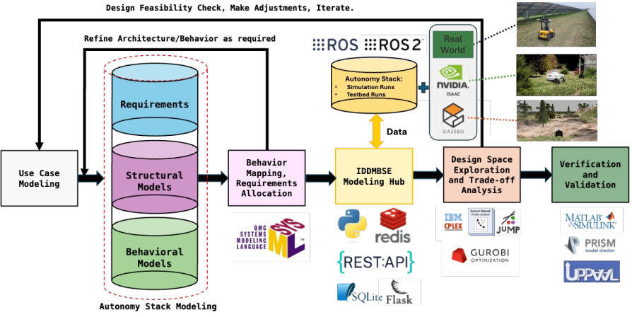

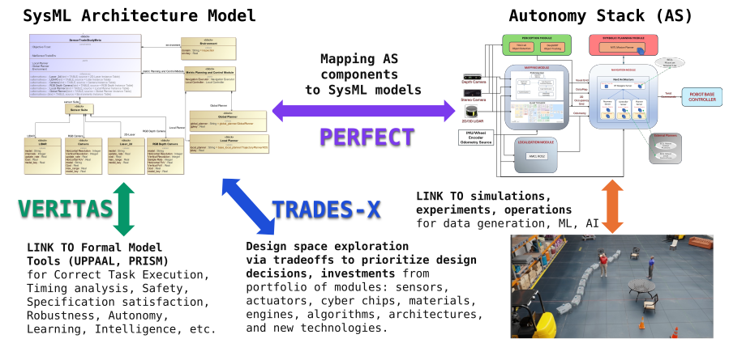

## The tools

### PERFECT — SysML-to-ROS 2 performance evaluation ([`perfect/`](perfect/README.md))

A server hosts the component library, the experiment database and a REST plus WebSocket API; a
job queue dispatches experiments to distributed runners, each of which executes an experiment
directory's `experiment.py` — a Gazebo or Isaac Sim launch, or a ROS-free simulation — and
streams the trial results back. A design is a set of component implementations, an environment
an instantiated template, an experiment their union, a trial one run. The SysML model binds to
it through the component/implementation split ([`perfect/docs/sysml-binding.md`](perfect/docs/sysml-binding.md)).

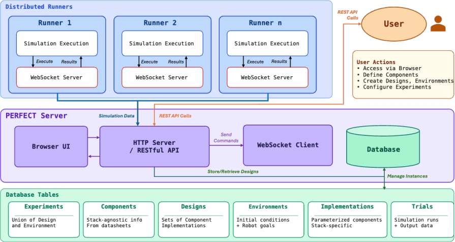

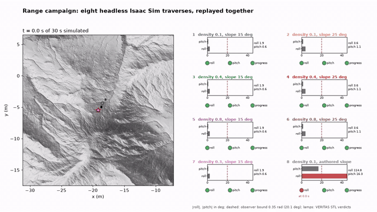

### TRADES-X — hybrid design-space exploration ([`trades-x/`](trades-x/README.md))

A model-based optimization stage (Julia: enumeration, a greedy submodular search, Pareto
filtering over catalogue attributes) prunes the design space to a frontier; a data-driven stage
submits the survivors to PERFECT as a campaign over scenario environments, collects the trial
table over the API and ranks the designs with a Multi-Attribute Value Function whose attributes
are partitioned a priori into what the models prove and what the data measures. Automatic
differentiation ranks the requirements by sensitivity.

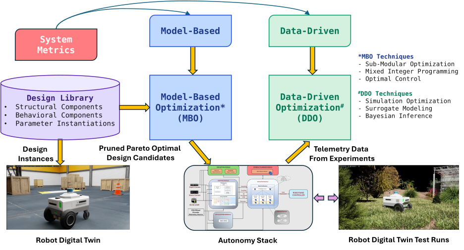

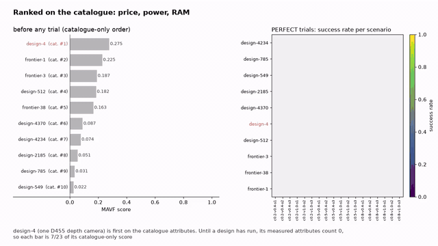

### VERITAS — three-module verification ([`veritas/`](veritas/README.md))

A model-based module translates SysML state machines and behavior trees into UPPAAL timed
automata and runs the model checker; a data-driven module computes failure rates with
confidence bounds and STL-robustness statistics over any PERFECT campaign database; a runtime
module monitors a deployed stack with an STL observer and a temporal-behavior-tree monitor, live
on a ROS 2 graph or replayed over recorded trajectories.

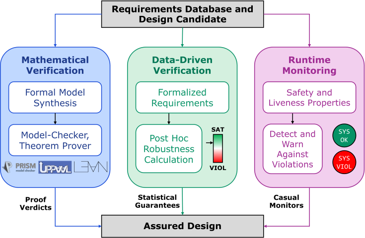

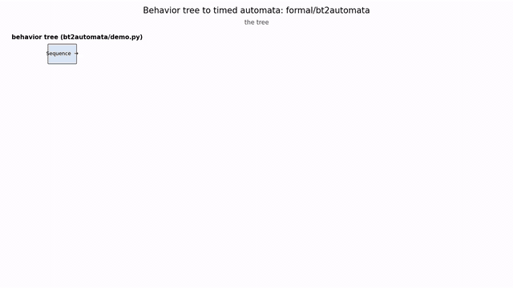

## Showcases

Every animation is rendered from data in this repository by a script beside it; each README
card names the inputs and the numbers on screen.

| | |
|---|---|
| [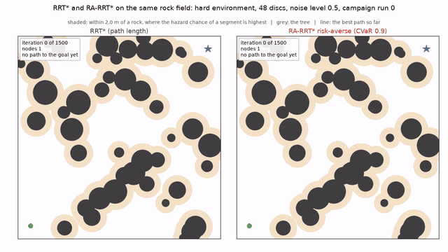](case-studies/A2-risk-sensitive-planning/README.md) | [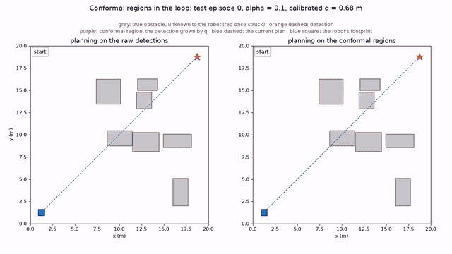](case-studies/B2-conformal-perception/README.md) |
| RRT* and the risk-averse RA-RRT* growing from the same seed on the hard rock field ([A2](case-studies/A2-risk-sensitive-planning/README.md)) | The robot planning on raw detections collides; planning on conformal regions it reaches the goal ([B2](case-studies/B2-conformal-perception/README.md)) |
| [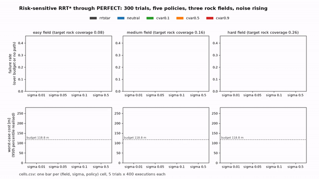](demos/README.md) | [](demos/README.md) |
| Five planner policies over three rock fields as the noise rises, from PERFECT's 300-trial table ([demos](demos/README.md)) | The eight range traverses with roll and pitch gauges and the STL observer's lamps ([demos](demos/README.md)) |
| [](demos/README.md) | [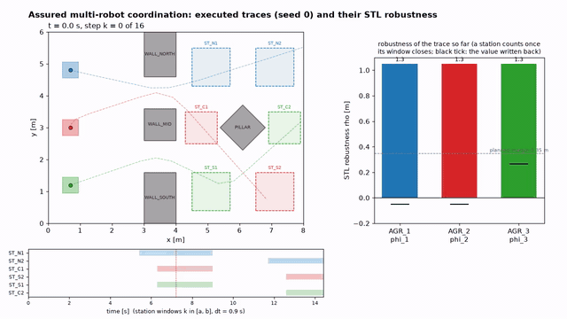](demos/README.md) |
| TRADES-X's data-driven stage: the catalogue-first design falls to last once PERFECT has run it ([demos](demos/README.md)) | The three robots, their station windows, the separation breach and the robustness written back ([demos](demos/README.md)) |

## What is here

| directory | what it is |
|---|---|
| [`perfect/`](perfect/README.md) | PERFECT: server, job queue, runners, the `/api/v1` REST interface, twelve example experiments |
| [`trades-x/`](trades-x/README.md) | TRADES-X: the Julia model-based stage, the Python data-driven stage and MAVF, the sensor-suite and test-range studies |
| [`veritas/`](veritas/README.md) | VERITAS: the formal, data-driven and runtime modules with their UPPAAL, campaign and replay results |
| [`sysml/`](sysml/README.md) | the SysML model of the AGR stack and the MATLAB workbench that calls PERFECT from it |
| [`isaacsim/`](isaacsim/README.md) | the contested-terrain test range, its design-of-experiments and campaign tools, and the cluttered warehouse with the Carter and Nav2 |
| [`case-studies/`](case-studies/README.md) | the six case studies of the paper's Section IV |
| [`pipeline/`](pipeline/README.md) | one command that runs the tool chain end to end |
| [`demos/`](demos/README.md) | the animations, each rendered from campaign data by its own script |
| [`seil-r2/`](seil-r2/README.md) | the ROS 2 Carter navigation workspace and its container |
| [`plugins/`](plugins/README.md) | an rviz2 panel for controller and planner selection |
| [`assets/paper/`](assets/paper/) | the paper's figures |

## Map to the paper

| paper section | where |
|---|---|
| III-A, Methodology | [`sysml/`](sysml/README.md) |
| III-B, PERFECT | [`perfect/`](perfect/README.md) |
| III-C, TRADES-X | [`trades-x/`](trades-x/README.md) |
| III-D, VERITAS | [`veritas/`](veritas/README.md) |
| IV-A.1, Sensor-suite selection | [`case-studies/A1-sensor-suite-selection/`](case-studies/A1-sensor-suite-selection/README.md) |
| IV-A.2, Risk-sensitive path planning | [`case-studies/A2-risk-sensitive-planning/`](case-studies/A2-risk-sensitive-planning/README.md) |
| IV-A.3, Behavior-tree task specifications | [`case-studies/A3-behavior-tree-verification/`](case-studies/A3-behavior-tree-verification/README.md) |
| IV-B.1, The contested-terrain test range | [`case-studies/B1-contested-terrain-range/`](case-studies/B1-contested-terrain-range/README.md) |
| IV-B.2, Robust perception via conformal prediction | [`case-studies/B2-conformal-perception/`](case-studies/B2-conformal-perception/README.md) |
| IV-B.3, Assured multi-robot coordination | [`case-studies/B3-assured-multi-robot/`](case-studies/B3-assured-multi-robot/README.md) |

## Getting started

One command brings up a private PERFECT stack, runs the sensor-suite campaign through TRADES-X,
reports and verifies with VERITAS, replays the range trajectories and writes a summary
([`pipeline/README.md`](pipeline/README.md)); `--all` adds the planner and calibration campaigns,
`--range` the Isaac Sim range campaign.

```bash
bash pipeline/run.sh
```

Each tool is its own Python project managed with [uv](https://docs.astral.sh/uv/):

```bash
cd perfect  && uv venv --python 3.12 && uv pip install -e .   # PERFECT
cd trades-x && uv sync                                        # TRADES-X (the Julia stage: cd mbo && julia --project=. -e 'using Pkg; Pkg.instantiate()')
cd veritas  && uv sync                                        # VERITAS (UPPAAL: set UPPAAL_HOME)
cd isaacsim/tools && uv sync                                  # the range tools (Isaac Sim 6.0 for the scenes)
cd case-studies/<study> && uv sync && uv run python run_case_study.py
```

With a ROS 2 environment sourced, run tests as `env -u PYTHONPATH uv run pytest`. Each README
carries the tool's own bring-up, examples and recorded results.

## License

MIT ([`LICENSE`](LICENSE)) for everything in this repository — code, scene files, models and
data. Content that the Isaac Sim setup scripts download from NVIDIA's asset packs stays under
NVIDIA's own terms and is not part of the repository.

## Citing

```bibtex
@misc{baras2026iddmbse,
  title         = {IDDMBSE: Integrating Data-Driven and Model-Based Systems Engineering for Trusted Autonomous Cyber-Physical Systems},
  author        = {John S. Baras and Sai Sandeep Damera and Ryan Matheu and Clinton Enwerem and Praveen M. S. Kumar},
  year          = {2026},
  eprint        = {2606.06727},
  archivePrefix = {arXiv},
  primaryClass  = {cs.RO},
  url           = {https://arxiv.org/abs/2606.06727},
}
```

See [`CITATION.cff`](CITATION.cff) for the machine-readable form.
