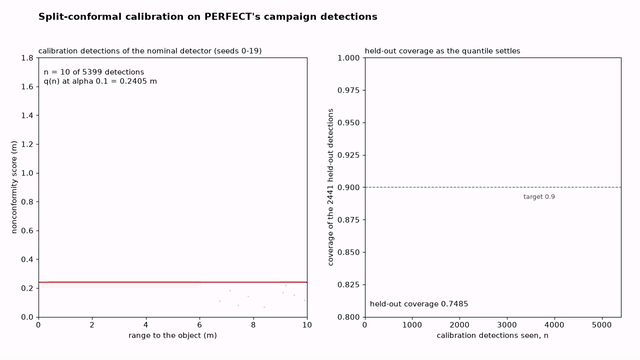

# Demos

Five animations rendered from results recorded in this repository: the sensor-suite
campaign PERFECT ran for TRADES-X, the eight headless Isaac Sim traverses of the range
campaign with the VERITAS observer's verdicts, the assured multi-robot study, and the
risk-sensitive planner and conformal-calibration campaigns PERFECT ran for the case
studies. Each one is a matplotlib figure driven frame by frame and written by ffmpeg as
an H.264 MP4 (1920 x 1080, 24 fps; the render wall times below were measured for the earlier
1280 x 720 default), a 640 px palette GIF, and a poster frame in SVG and
PDF drawn by the same code. Every number on screen comes from the input files named on
its card; nothing is re-simulated.

```
cd demos
uv sync
./make_all.sh                  # all five, into animations/<name>/
uv run python animations/range_replay/make.py --out /tmp/range --frames 24   # a quick short render
uv run pytest -q
```

Every `make.py` takes `--out <dir>`, `--frames N` (N frames spread over the whole
timeline) and `--fps`, and prints the frame count, the duration and the output sizes.
Two renders give the same frame counts and byte-identical posters. `make_all.sh` took
3 min 57 s here (2026-09-22), one animation at a time.

The two animations of the 2024 model-based optimization stage live beside the Julia code
in `trades-x/mbo/`: `mosmo_approx_pareto.gif` and `pareto_optimal_designs.gif`.

## mavf_ranking_flip


The ten sensor-suite designs start in the order the Multi-Attribute Value Function gives
them on catalogue attributes alone (price, power, RAM), where `design-4`, a single D455
depth camera, is first. PERFECT's 180 trials then arrive in campaign order (by experiment
id, one design at a time, eighteen scenarios each): the success-rate heat fills in on the
right and the bars re-sort under the joint MAVF, the catalogue attributes weighted 7/23
and the six measured ones 16/23 as the requirement partition splits the 23 requirements.
While the campaign runs, a design's measured attributes are the mean of its trials so far,
the value functions span the designs measured so far, and a design with no trial yet
scores 0 on the measured attributes; after the last trial the bars are the recorded
scores, and `design-4` is last.

- On screen: final MAVF scores 0.6732 (`design-4370`) down to 0.3909 (`design-4`);
  `design-4` catalogue rank 1, MAVF rank 10, success rate 0.44; each design's
  catalogue-only rank; the success rate of every trial.
- Inputs: `trades-x/case-studies/sensor-suite/results/ddo_campaign.csv` (one row per
  trial: `experiment_id`, `success_rate` and the five other measured metrics),
  `results/mavf_ddo_ranking.csv` (`mavf_score`, `mavf_rank`, `mbo_only_rank`,
  `mbo_only_score`, `cost`, `power`, `ram`, `success_rate`), `requirements.yaml` (the
  `class` of each requirement).
- Command: `uv run python animations/mavf_ranking_flip/make.py`
- Output: 21.0 s, 504 frames; render wall time 43.2 s.

## range_replay


The eight Carter traverses of the range campaign, each a headless Isaac Sim 6.0.1 trial
driven by PERFECT, replayed together over a hillshade of the range heightmap in the
axes of `isaacsim/results/campaign_trajectories.svg` (start +/- 12 m). The MP4 runs the
30 s of simulation at real time; the GIF runs it at 2x. Each traverse has a tile with its
obstacle density and slope, |roll| and |pitch| gauges against the observer's 0.35 rad
(20.1 deg) bound, and the VERITAS STL observer's three lamps (roll, pitch, progress),
which turn red at the first-violation times its replay recorded.
The hillshade is the authored relief; each trial's layer scales that relief by its slope
target's height scale (0.21 at 15 deg, 0.37 at 25 deg, 1 for the authored slope) and adds
the rocks of its obstacle density, and neither the scaling nor the rocks is drawn here.

- On screen: trial 5 (density 0.8, slope 15 deg) progress violated at 25.7 s; trial 7
  (density 0.3, slope 15 deg) roll violated at 29.85 s; trial 8 (density 0.1, authored
  slope) roll violated at 0.0 s, its roll reading between 78 and 179 deg for the whole
  run; every other lamp stays green; the attitude readouts are the trajectory's own roll and pitch.
- Inputs: `isaacsim/results/trajectories/trial_{1..8}.csv` (`t, x, y, z, roll, pitch,
  yaw, v` at 60 Hz), `isaacsim/results/campaign.csv` (`obstacle_density`,
  `max_slope_deg`), `veritas/runtime/stl-observer/results/range/verdicts.csv`
  (`*_first_violation_s`), `veritas/runtime/stl-observer/specs/range_safety.yaml` (the
  bound), `isaacsim/range/terrain/heightmap.npz` and `terrain_meta.json` (the relief).
- Command: `uv run python animations/range_replay/make.py`
- Output: 30.0 s, 720 frames (GIF 15 s at 12 fps); render wall time 74.7 s.

## multirobot_room


The three robots of the assured multi-robot study follow their executed trajectories
(seed 0) through the room at real time, with the MILP plans dashed, each robot drawn with
its 0.5 m separation footprint, and the walls, the rotated pillar and the six stations
drawn from the fleet requirements. The timeline below lights each station window while it
is open. At step 8 AGR_1 and AGR_2 come closer than the 0.5 m separation, and the breach
is marked where it happened. On the right each robot's STL robustness is evaluated on the
trace so far (a station term counts once its window has closed) and falls to the value
VERITAS wrote back into the fleet model.

- On screen: `sep(1,2) = -0.052 m at k = 8 (t = 7.2 s)`; final robustness AGR_1
  -0.051655 m and AGR_2 -0.051655 m (violated, `sep(1,2)@k=8`), AGR_3 0.265563 m
  (satisfied, `OBS_WALL_SOUTH@k=6`); the planned margin 0.35 m; station windows in steps
  of dt = 0.9 s.
- Inputs: `case-studies/B3-assured-multi-robot/model/fleet_requirements.yaml` (map,
  stations, windows, `d_min`, `dt`), `results/summary.json` (`plan`, `executed`,
  `required_margin`), `results/goal_satisfaction.json` and `model/agr_fleet.yaml` (the
  values written back).
- Command: `uv run python animations/multirobot_room/make.py`
- Output: 19.4 s, 466 frames; render wall time 28.6 s.

## rarrt_noise_sweep


The five planner policies (plain RRT\*, the risk-neutral planner and CVaR at 0.1, 0.5 and
0.9) in PERFECT's 300-trial campaign, one column per rock field. The noise level sigma
steps through 0.01, 0.05, 0.1 and 0.5, and at each step a new group of bars grows: the
failure rate on top (realised cost over the traversal budget, or no path) and the
worst-case realised cost, the 95th percentile, below, against the 118.8 m budget. Each
panel names the lowest and highest policy at the current level.

- On screen: at sigma 0.5 plain RRT\* fails 0.208 (easy), 0.3005 (medium) and 0.4225
  (hard) of its executions against 0.0675, 0.1465 and 0.2535 for the lowest policy, and its
  worst case is 206.0, 232.2 and 266.1 m against 128.5, 163.9 and 185.3 m; every cell's
  failure rate and worst case.
- Inputs: `case-studies/A2-risk-sensitive-planning/results/perfect/cells.csv`
  (`failure_rate`, `worst_case_p95`; five trials of 400 executions per cell),
  `results/perfect/summary.json` (the grid, `budget_factor`, `straight_line`).
- Command: `uv run python animations/rarrt_noise_sweep/make.py`
- Output: 18.0 s, 432 frames; render wall time 53.6 s.

## calibration_curve



The split-conformal calibration of the conformal-perception study on the detections
PERFECT's 270-trial campaign wrote back. The nominal detector's 5399 calibration
detections (seeds 0 to 19) accumulate as a scatter of nonconformity score against range;
the conformal quantile at alpha = 0.1 of the detections seen so far is the red line; and
the coverage that quantile gives on the 2441 held-out detections (seeds 20 to 29) draws
itself against the number of detections seen and ends at 0.9156 against the 0.9 target.
Then the alpha sweep: held-out coverage as a function of the margin q, the degraded detector's
curve beside it, and the seven calibrated levels marked on both.

- On screen: q = 0.6478 m and held-out coverage 0.9156 at alpha = 0.1 after all 5399
  detections; the alpha table from 0.3 (q 0.2292 m, held-out 0.721, degraded 0.016) to
  0.01 (q 0.9845 m, held-out 0.9877, degraded 0.9261).
- Inputs: `case-studies/B2-conformal-perception/results/perfect/calibration.csv` (24 704
  detections with the true and detected boxes), `results/perfect/coverage.csv`,
  `results/perfect/summary.json` (`operating_point`). The score and the quantile are the
  case study's own: the largest amount by which the detected box falls inside the true
  box on any edge, and the ceil((n + 1)(1 - alpha))-th smallest score. The prefix
  quantiles are one masked sort in numpy.
- Command: `uv run python animations/calibration_curve/make.py`
- Output: 22.0 s, 528 frames; render wall time 34.4 s.

## Tests

`tests/test_animations.py` renders each animation at four frames, checks that the poster
exists and that decoded frames carry ink, and recomputes what each animation shows
straight from its input files: the final MAVF scores, ranking and catalogue ranking; the
three verdict times from the 60 Hz trajectories resampled to the observer's 20 Hz; the
final robustness values against a step-by-step oracle and the breach step; every cell's
failure rate from the per-trial `over_budget` column; the held-out coverage and quantile
at alpha = 0.1, and the prefix quantiles against a sort of each prefix.
