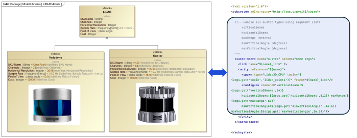
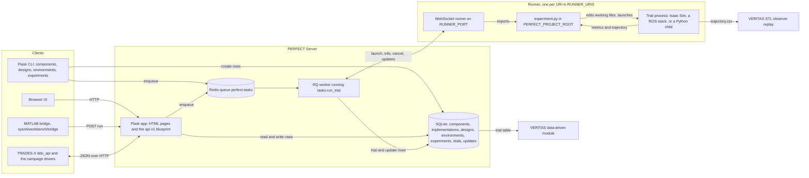

# PERFECT

PERFECT (PERFormance Evaluation Composable Toolsuite) is the performance-evaluation tool of
IDDMBSE, described in Section III-B of the paper. It turns a system architecture into a
campaign of simulated trials on a ROS or simulator-backed autonomy stack: a component
library, designs composed from it, environments, and experiments pairing the two go into a
SQLite database; a Flask server with a browser UI and a JSON API at `/api/v1` queues each
trial on Redis; runners execute the trials and stream their state and measurements back over
a WebSocket. What comes out is a trial table (state, timing and every relayed metric) that
TRADES-X ranks designs from and VERITAS computes failure rates over. The SysML side reaches
the same server through `POST /api/v1/run` and the binding in
[`docs/sysml-binding.md`](docs/sysml-binding.md).


The Server (browser UI, HTTP and REST API, WebSocket client, database) and the distributed
Runners that execute simulations and return results; the bottom row lists the database
tables.



A generic LiDAR block specialised into two sensor variants on the SysML side (left), and the
spawn-and-configure description a Component Implementation carries for one of them (right).

## What PERFECT models

System definitions (for example, of a UGV) are broken into cohesive, decoupled "components"
such as sensors, planners, and controllers. A "design" consists of a subset of components
sufficient for defining an instance of a general design that may be tested and evaluated.
Simulated environments and operation plans (i.e., instructions and scenarios) are also
represented as a subset of cohesive, decoupled components.

An "experiment" is a combination of design, environment, and operation plan sufficient to
run a simulation to completion, with well-defined success and failure states (usually the
result of a ROS action specified by the operation plan). Information about a robot's state
or the state of its environment can be collected and analysed in real time; the results may
inform decisions about cancelling an experiment early if a failure state (defined at a
higher level than the ROS action) is reached. Each run of an experiment is a trial.

One goal for PERFECT is that it may be driven from the Systems Modeling Language (SysML), so
that the SysML-defined model of the robot system is mapped to the actual implementation in
ROS. Applications such as Magic Systems of Systems Architect, which simulate SysML-defined
models, may control and receive data from those simulations, brokered by PERFECT, over the
same RESTful API a browser or a script uses.

## Architecture



The flow of one trial: a client creates an experiment (a design and an environment) and
enqueues a trial on Redis; the RQ worker asks each runner in `RUNNER_URIS` whether it is
free (`info`), sends the chosen one a `launch` with the design and environment JSON, and
writes every `{"update": ..., "data": ...}` message the runner streams back into the
`trial` and `update` tables. The runner imports `experiment.py` from its working directory,
which applies the design's and environment's edits to its working files and starts the trial
process. `TrialState` is a `Flag` (`perfect/experiment/experiment.py`), so a finished trial
reads `TrialState.SUCCESSFUL|SHUT_DOWN`.

## Directory map

| path | what it is |
|---|---|
| `setup.py` | the package definition: `perfect` 0.0.2 and its dependencies (Flask, Flask-Migrate, Flask-SQLAlchemy, RQ, Redis, websockets, jsonschema) |
| `perfect/app/__init__.py` | `create_app`: the Flask app, the SQLite database under `PERFECT_PROJECT_ROOT`, the Redis connection and the `perfect-tasks` queue |
| `perfect/app/config.py` | defaults read from the environment: `PERFECT_PROJECT_ROOT`, `REDIS_URL`, `RUNNER_URIS` |
| `perfect/app/models.py` | the tables: `Component`, `ComponentImplementation`, `Design`, `EnvironmentTemplate`, `Environment`, `Experiment`, `Trial`, `Update` |
| `perfect/app/routes/` | one blueprint per table (`components`, `designs`, `environments`, `experiments`, with their CLI commands), `main` (the home page) and `api.py` (the `/api/v1` JSON routes) |
| `perfect/app/schema/` | JSON schemas: `implementation_schema.json` (what a component implementation may carry), `robot_schema.json`, `robot_template_schema.json` |
| `perfect/app/tasks.py` | the RQ job: pick a free runner, send `launch`, relay the runner's updates into the database, forward a cancel |
| `perfect/app/templates/`, `static/`, `forms.py` | the browser UI |
| `perfect/experiment/experiment.py` | `BaseExperiment` (init, ready, run, shut-down loop), `TrialState`, and the YAML and USD working-file editors |
| `perfect/experiment/runner.py` | the WebSocket runner: `launch`, `info`, `cancel`, `close`, `restart`, `get_last_msg` |
| `perfect/experiment/ros/` | `RosExperiment` and its ROS 1 (rosbridge) and ROS 2 (`rclpy`) subclasses |
| `perfect/experiment/local.py` | run one trial in-process against a database, without a runner |
| `perfect/common/` | `RUNNER_PORT`, a built-in component library (Nav2 navigation and planner, camera, 2D and 3D lidar), a ROS 2 Nav2 implementation and two Nav2 operation-plan templates |
| `perfect/devtools/` | `reset_db.sh` (recreate the database and load the built-in library), `test_runner.py` (send one op to a runner), `ros2_count_nodes.py` |
| `devtools/smoke_dummy.sh` | the unattended end-to-end check on the `dummy` example |
| `docs/bring-up.md` | the recorded bring-up with every command's printout |
| `docs/sysml-binding.md` | how a SysML model maps onto the schema, and the request and reply of `POST /api/v1/run` |
| `sysml-profile/perfect.sysml` | a SysML v2 textual profile declaring `ROS2Node`, `ROS2Topic`, `ROS2Parameter` and `ComponentImplementation` |
| `perfect_stream.m` | a MATLAB live plot of a running experiment's linear and angular velocity |
| `examples/` | one PERFECT project root per experiment; see [Examples](#examples) |

## Install

A uv virtual environment inside `perfect/`. `setup.py` stays the package definition; no
`pyproject.toml` is needed.

```bash
cd /path/to/IDDMBSE/perfect
uv venv --python 3.12          # -> "Creating virtual environment at: .venv"            (0.01 s)
uv pip install -e .            # -> "+ perfect==0.0.2 (from file:///.../perfect)"       (0.78 s)
source .venv/bin/activate
python -c "import perfect, flask, rq, redis; print(perfect.__file__)"
```

The versions resolved on 2026-09-22 were flask 3.1.3, flask-migrate 4.1.0, flask-sqlalchemy
3.1.1, rq 2.12.0, redis 8.1.0, sqlalchemy 2.0.54, websockets 17.1. PERFECT's ROS experiment
classes (`perfect/experiment/ros/`) additionally need `rclpy`, so an example that drives ROS
has to be run from a Python environment that has ROS 2 on its path. You also need a
`redis-server`.

## Bring-up, as measured

The full record, with every command's printout and wall time, is
[`docs/bring-up.md`](docs/bring-up.md). It was run end to end on the `dummy` example on
2026-09-22 (Ubuntu, Python 3.12.11). The short version:

| what | port |
|---|---|
| Redis | 6390 (a private instance; 6379 was taken by another service) |
| Flask server | 5001 |
| PERFECT runner | 8003, the default; `RUNNER_PORT` changes it, `RUNNER_URIS` (comma-separated) points the server at runners elsewhere |

```bash
# Redis, in its own terminal
redis-server --port 6390 --save '' --appendonly no --dir /tmp/perfect-redis

# in every other terminal
export PERFECT_PROJECT_ROOT=/path/to/IDDMBSE/perfect/examples/dummy
export REDIS_URL=redis://127.0.0.1:6390
source /path/to/IDDMBSE/perfect/.venv/bin/activate
cd $PERFECT_PROJECT_ROOT

# database, library, one design, one environment, one experiment (once)
python -m flask --app perfect.app db init
python -m flask --app perfect.app db migrate -m "Initial migration."
python -m flask --app perfect.app db upgrade
python -m flask --app perfect.app components load_component_implementations components.json
python -m flask --app perfect.app designs create "Widget A" "Dijkstra" -i \
    --name "Widget A + Dijkstra" --tag demo
python -m flask --app perfect.app environments create_explicit "Nothing" '{}' -t demo
python -m flask --app perfect.app experiments create demo demo -t demo

# the three long-lived processes, one terminal each
rq worker perfect-tasks --url redis://127.0.0.1:6390
python -m perfect.experiment.runner
python -m flask --app perfect.app run --port 5001

# run one trial and read its state back
python -m flask --app perfect.app experiments run demo
curl -s http://127.0.0.1:5001/experiments/ | grep -- '-state'
# <td id="1-state">TrialState.SUCCESSFUL|SHUT_DOWN</td>
```

The trial took 19.3 s from enqueue to `SHUT_DOWN` (4 s of `_init`, then the 15 s
countdown). `PERFECT_PROJECT_ROOT` must also be the working directory: the runner does
`__import__("experiment")`. `experiments create` matches designs and environments by tag,
not by name. The browser UI is `http://localhost:5001/`.

**The smoke test** runs all of the above unattended against a throwaway copy of
`examples/dummy`, then a second trial through `POST /api/v1/run`, and tears everything down:

```bash
perfect/devtools/smoke_dummy.sh
# project root /tmp/perfect-smoke-CW4V3l, redis 6390, flask 5001, runner 8003
# --- experiments run demo
# experiment 1 state: TrialState.SUCCESSFUL|SHUT_DOWN
# --- POST /api/v1/run (the payload MatSensorTrade.m sends)
# experiment 2 state: TrialState.SUCCESSFUL|SHUT_DOWN
# PASS
```

46.3 s wall on 2026-09-22. It takes `--redis-port`, `--flask-port`, `--runner-port`,
`--no-api-run` and `--keep`, refuses to start if one of its ports is listening, and kills
everything it started on exit.

## How it connects

### The JSON API

The HTML pages are one surface; `/api/v1` is the other. It has **no authentication** —
anything that can reach the Flask port can create and run experiments. Keep it on
localhost.

| method | route | what it does |
|---|---|---|
| GET | `/api/v1/components` | `Component` rows, each with its `ComponentImplementation` nested |
| GET | `/api/v1/component_implementations` | `ComponentImplementation` rows |
| GET | `/api/v1/designs`, `/api/v1/designs/<id>` | designs with components and merged implementation |
| GET | `/api/v1/environments`, `/api/v1/environments/<id>` | environments, specification parsed to JSON |
| GET | `/api/v1/experiments` | one line per experiment with `last_trial_state` |
| GET | `/api/v1/experiments/<id>` | the experiment with design, environment and every trial |
| GET | `/api/v1/environment_templates` | environment templates with their specification |
| GET | `/api/v1/trials/<id>` | one trial with its `Update` rows (`?updates=N`, default 100) |
| POST | `/api/v1/component_implementations` | create component implementations from a list; each is validated against `schema/implementation_schema.json` and one already there is returned unchanged |
| POST | `/api/v1/designs` | create a design from component-implementation ids or names; a design of that name already there is returned unchanged |
| POST | `/api/v1/environment_templates` | create a template from a name and a specification |
| POST | `/api/v1/environments` | create an environment, either from a template id plus `arguments` or from a specification directly |
| POST | `/api/v1/experiments` | create and enqueue from design ids and environment ids |
| POST | `/api/v1/experiments/<id>/run` | enqueue another trial of an existing experiment |
| POST | `/api/v1/run` | the SysML-to-MATLAB bridge endpoint |

Unlike `GET /experiments/updates` (what the HTML pages poll, which **deletes** the `Update`
rows it returns), none of these deletes anything. The four library and environment POST
routes each match on the row's name first and return what is already there, so a campaign
script that sets a project up can be re-run without duplicating it; they call the same
create functions the Flask CLI calls. The request bodies are in
[`docs/sysml-binding.md`](docs/sysml-binding.md#the-rest-of-the-api); the full
`/api/v1/experiments/1` reply and a `POST /api/v1/run` against `dummy` are in
[`docs/bring-up.md`](docs/bring-up.md#the-json-api).

### Who calls it

| client | what it does with PERFECT | code |
|---|---|---|
| TRADES-X, data-driven stage | submits a design-by-scenario campaign over `/api/v1`, waits for every trial to reach a terminal state, collects the relayed metrics into a table and ranks the designs by MAVF | [`trades-x/tradesx/ddo_api.py`](../trades-x/tradesx/ddo_api.py), [`run_ddo_campaign.py`](../trades-x/case-studies/sensor-suite/run_ddo_campaign.py) |
| case-study campaign drivers | the same `submit` / `wait` / `collect` for the planner, calibration and multi-robot examples | [`A2`](../case-studies/A2-risk-sensitive-planning/run_perfect_campaign.py), [`B2`](../case-studies/B2-conformal-perception/run_perfect_campaign.py), [`B3`](../case-studies/B3-assured-multi-robot/run_perfect_campaign.py) |
| the Isaac Sim range DOE | one POST per grid point of obstacle density, slope, friction, restitution and seed; collects one CSV row per trial and plots it | [`isaacsim/tools/range_campaign.py`](../isaacsim/tools/range_campaign.py) |
| VERITAS, data-driven module | opens PERFECT's SQLite file and reads the trial states and metrics for failure rates and confidence bounds | [`veritas/datadriven/perfect_adapter.py`](../veritas/datadriven/perfect_adapter.py) |
| VERITAS, runtime module | replays the `trajectory.csv` files the range trials wrote through the STL observer | [`replay_observer.py`](../veritas/runtime/stl-observer/replay_observer.py), [`isaacsim/results/trajectories/`](../isaacsim/results/trajectories) |
| SysML model through MATLAB | the constraint blocks call MATLAB functions that `POST` to `/api/v1/run`; the server matches the payload against the library and enqueues an experiment | [`sysml/workbench/bridge/`](../sysml/workbench/bridge), [`docs/sysml-binding.md`](docs/sysml-binding.md) |

## Examples

`examples/` holds one directory per experiment. Each is a PERFECT project root: a
`components.json` or an `impl.py` describing the library, an `experiment.py` subclassing one
of the base experiments, and usually a `load.bash` with the CLI sequence that sets the
project up. Point `PERFECT_PROJECT_ROOT` at one and bring the four terminals up as above.

| example | what it is |
|---|---|
| [`dummy`](examples/dummy) | no simulator at all: the trial runs `countdown.bash` in a subprocess. It is the example the bring-up above uses, and the one to try first |
| [`sensor-suite-sim`](examples/sensor-suite-sim) | a planar navigation simulation in plain Python whose measured metrics depend on which sensors the design carries and on how cluttered and how dark the environment is. No ROS, no simulator, a trial in about 1.5 s |
| [`isaacsim-range`](examples/isaacsim-range) | one headless Isaac Sim run on the contested-terrain range in this repository's `isaacsim/` directory. The experiment writes a design-point layer, launches Isaac Sim as a child process, drives the robot and relays the metrics and a pose trajectory |
| [`rarrt-planning`](examples/rarrt-planning) | the risk-sensitive RA-RRT* planner as a behavioural design variable: five policies as one component's implementations, a rock field x noise level x seed as the environment; the trial runs the planner package from `case-studies/A2-risk-sensitive-planning` in a subprocess and relays its metrics. 300 trials ran here in 7 min 44 s |
| [`conformal-calibration`](examples/conformal-calibration) | calibration data for conformal perception: a detector configuration as the design, a clutter band and seed as the environment; the trial runs one closed-loop episode from `case-studies/B2-conformal-perception` and relays its detection rows. 270 trials ran here in 6 min 22 s, 24 704 rows |
| [`multirobot-milp`](examples/multirobot-milp) | assured multi-robot coordination: a station allocation and a required STL robustness margin as the design, a tracking-disturbance level and seed as the environment; the trial runs the MILP synthesis, one execution, the STL robustness scoring and the write-back from `case-studies/B3-assured-multi-robot` in a subprocess and relays the verdicts and both trajectories. 216 trials ran here in 38 min 27 s on four runners |
| `isaacsim-carter` | the Nova Carter in Isaac Sim driven through Nav2: the experiment rewrites `carter_navigation`'s Nav2 parameter file from the design and launches the stack |
| `isaacsim-husky` | the same shape for a Clearpath Husky in Isaac Sim, over `clearpath_nav2_demos`' Nav2 configuration |
| `ros2-clearpath` | a Clearpath Husky on ROS 2 with Nav2 and no Isaac Sim, rewriting both the Nav2 parameters and the robot description |
| `ros2-turtlebot3` | TurtleBot3 Burger and Waffle with SLAM and two Nav2 behavior trees, as a five-entry component library |
| `ros1-clearpath-husky` | the ROS 1 Clearpath Husky experiment, recording `/cmd_vel` and `/odom` |
| `SEILR1` | the sensor-suite library the SysML bridge matches against: eight lidar and laser-scanner implementations with their rates. `robustness.bash` is its scoring script and `perfect_stream.m` its MATLAB side |

What ran end to end here (each example's own README carries the detail):

- **`dummy`** — one trial from enqueue to `TrialState.SUCCESSFUL|SHUT_DOWN` in 19.3 s, and
  `devtools/smoke_dummy.sh`, which brings the whole stack up, runs two trials (one through
  `experiments run`, one through `POST /api/v1/run`) and tears it down, printing `PASS` in
  46.3 s.
- **`sensor-suite-sim`** — 30 tests pass in 0.71 s; one recorded trial with the
  VLP-16-A + LMS111-b1 + D435 + Blackfly-A suite at clutter 0.5, visibility 0.4 and twelve
  draws reported `success_rate 1.0`, `time_to_goal 37.48`, `detection_distance 13.91`. Ten
  designs across eighteen scenarios were run as a 180-trial campaign over `/api/v1`, all of
  them reaching `TrialState.SUCCESSFUL|SHUT_DOWN` in 4 min 35 s on one runner;
  [`trades-x/case-studies/sensor-suite/README.md`](../trades-x/case-studies/sensor-suite/README.md)
  has that campaign and the ranking it fed.
- **`isaacsim-range`** — eight trials through a stack on Redis 6390, Flask 5001 and the
  runner on 8003, each one a headless Isaac Sim 6.0.1 process started by the runner's job.
  Every trial reached `TrialState.SUCCESSFUL|SHUT_DOWN`; stage open took 13.8 to 14.2 s,
  physics initialisation 5.75 to 6.14 s, and a whole trial 41.8 to 48.6 s, 346 s of the
  campaign's 411 s. [`isaacsim/README.md`](../isaacsim/README.md) has the design points and
  the resulting table.
- **`rarrt-planning`**, **`conformal-calibration`** and **`multirobot-milp`** — the trial
  counts and times in the table above, each campaign submitted and collected over `/api/v1`
  by its case study's `run_perfect_campaign.py`.

The ROS-backed examples each need their own robot stack on the machine: the Nav2
configuration package the experiment rewrites, the simulator it launches, and a ROS
environment on the interpreter's path. `components.json` and `impl.py` in each directory
name which.

## Animations


The eight range trials PERFECT ran, each a headless Isaac Sim traverse, replayed together over
the range's hillshade with roll and pitch gauges and the VERITAS observer's lamps
([`demos/`](../demos/README.md) has the MP4 and the inputs).


The ten sensor-suite designs re-sorting under the MAVF as the 180 PERFECT trials arrive,
from the catalogue-only order to the order after the campaign.

## Tests

| what | command | recorded |
|---|---|---|
| the whole stack on `dummy` | `perfect/devtools/smoke_dummy.sh` | `PASS`, 46.3 s |
| `sensor-suite-sim` | `cd perfect/examples/sensor-suite-sim && python3 -m pytest tests -q` | 30 passed |
| `rarrt-planning` | `cd perfect/examples/rarrt-planning && python3 -m pytest tests -q` | 20 passed |
| `conformal-calibration` | `cd perfect/examples/conformal-calibration && python3 -m pytest tests -q` | 13 passed |

The example tests need numpy and pytest, plus pyyaml for the two that wrap case-study
packages and scipy for `rarrt-planning`; those two import the packages from `case-studies/`. With a ROS 2 environment sourced in the shell, run them
as `env -u PYTHONPATH python3 -m pytest tests -q` so pytest does not try to load ROS's own
plugins.

## Provenance

- Upstream: `https://code.umd.edu/drhunter/perfect` (UMD GitLab), author Daniel Robert Hunter
  (`drhunter@umd.edu`), package version 0.0.2.
- This directory is a snapshot of the upstream `example-isaacsim-husky` branch, tip of
  2025-01-02, imported into the IDDMBSE mono-repository on 2026-09-21.
- The design-space-exploration work that used to live here as `perfect_MBO/` (Julia MBO plus
  the MATLAB alternative) and `pyjulia_example/` now lives in `trades-x/` at the repository
  root, as `trades-x/mbo`, `trades-x/mbo-matlab-alt` and `trades-x/pyjulia-example`.
- Built for this release: the `/api/v1` blueprint, the SysML binding document and profile,
  the smoke test, and the `sensor-suite-sim`, `isaacsim-range`, `rarrt-planning`,
  `conformal-calibration` and `multirobot-milp` examples.

### Changes made here

**Getting the bring-up to run.** Five small changes let the snapshot run against current
dependency versions; each is either version compatibility or a plain defect, and none
changes what PERFECT does:

1. `perfect/experiment/experiment.py` — `from pxr import Usd` moved from module scope into
   `edit_local_usd()`, the only function that uses it. OpenUSD is not in `setup.py` and is
   only present in Isaac Sim's Python, so the top-level import made every PERFECT process
   (including the Flask server and the RQ worker) unimportable without Isaac Sim.
2. `perfect/app/models.py` — `rq_job.get_id()` to `rq_job.id` in `Trial.run()`. rq 2.x removed
   `Job.get_id()`; `Job.id` has been there in both 1.x and 2.x.
3. `perfect/experiment/runner.py` — `websockets.serve` returns an
   `websockets.asyncio.server.ServerConnection` from websockets 14 on, which has no `.open`
   or `.closed`. The `info` op now derives those two booleans from `.state`, so the JSON it
   replies with is unchanged. The type import moved off the deprecated
   `websockets.server.WebSocketServerProtocol`.
4. `perfect/app/routes/components.py` — a misplaced parenthesis meant the "Committed N
   Components" log line was replaced by an empty string whenever nothing was invalid, so a
   successful load reported nothing. Now parenthesised as intended.
5. `examples/dummy/` — `experiment.py` gained `_files = {}` (`BaseExperiment` iterates
   `self._files`, and the class-level annotation creates no attribute, so `DummyExperiment`
   raised `AttributeError` before it could start; every other example sets it).
   `components.json` was rewritten from a `specification` key, which no current loader reads,
   to the `implementation` key that `load_component_implementations` validates against
   `perfect/app/schema/implementation_schema.json`, each with `"parameters": []` as the other
   examples' `impl.py` produce.

**Built for this release.** The paper describes a RESTful plus WebSocket API and a SysML
binding. The WebSocket leg (worker to runner) comes from upstream; the JSON API and the
documented binding are new in this repository:

6. `perfect/app/routes/api.py` — the `/api/v1` blueprint, registered in `create_app`.
   Read-only routes over components, designs, environments, experiments and trials, the
   four library and environment POST routes, plus `POST /api/v1/experiments` (create and
   enqueue) and `POST /api/v1/run` (the bridge endpoint). It reuses `experiments._create`
   and `designs._create_design` rather than repeating their logic. No authentication,
   deliberately and documented: keep the server on localhost.
7. `perfect/app/routes/experiments.py` — `_create` now returns the experiment it
   committed. It returned `None`, so nothing outside the HTML form could enqueue what it
   had just created.
8. `perfect/app/routes/designs.py` — `component_implementation["parameters"]` became
   `.get("parameters", [])` in the two places it appears, and the matching `pop` gained a
   default. An implementation without a `parameters` key raised `KeyError` on
   `designs create`, which is every one of the five entries in
   `examples/ros2-turtlebot3/components.json`. After the fix that example's
   `designs create "Burger" "SLAM" -i` commits.
9. `perfect/common/__init__.py`, `perfect/app/config.py`, `perfect/experiment/runner.py` —
   the runner's port was the literal `8003` in `runner.py` and again inside `RUNNER_URIS`.
   It is now `RUNNER_PORT` (environment variable, default 8003), read in one place and
   used by both; `RUNNER_URIS` takes a comma-separated environment override.
10. `examples/SEILR1/components.json` — the 18 entries used a `specification` key that no
    loader reads, so the file loaded nothing. Rewritten to the `implementation` key, with
    the same 18 components and the same numbers: each sensor's specification became a
    `files` update writing that component's type as a key of `sensor.yaml` (which is the
    file `examples/SEILR1/experiment.py` edits, with the same keys), and each planner and
    controller became a `launchargs` entry on `base_global_planner` or
    `base_local_planner` (which is what `get_launch_args` in that file sets). All 18 now
    validate and load. `SEILR1/experiment.py`, a ROS 1 example, still builds its own
    `self._sensor_update` from a design keyed by component type and writes `sensor.yaml`
    itself, so it does not read these `files` entries.
11. New files: `devtools/smoke_dummy.sh` (the gate above), `docs/sysml-binding.md` (how a
    SysML model maps onto the schema, and the exact request and reply of
    `POST /api/v1/run`), `docs/bring-up.md` (the recorded bring-up), and
    `sysml-profile/perfect.sysml` (a SysML v2 textual profile declaring `ROS2Node`,
    `ROS2Topic`, `ROS2Parameter` and `ComponentImplementation`, with one worked example;
    PERFECT reads the JSON schema, and the profile fixes the same vocabulary for a v2
    model).
12. Outside this directory: the four MATLAB functions in `sysml/workbench/bridge/` were
    re-pointed from the 2023 `/run` endpoint to `/api/v1/run` and now return the
    experiment id from the reply instead of a hard-coded `1.0`. That directory's README
    records it.

## License

MIT, as the rest of the repository ([`../LICENSE`](../LICENSE)). The upstream author and
repository are named under [Provenance](#provenance).
