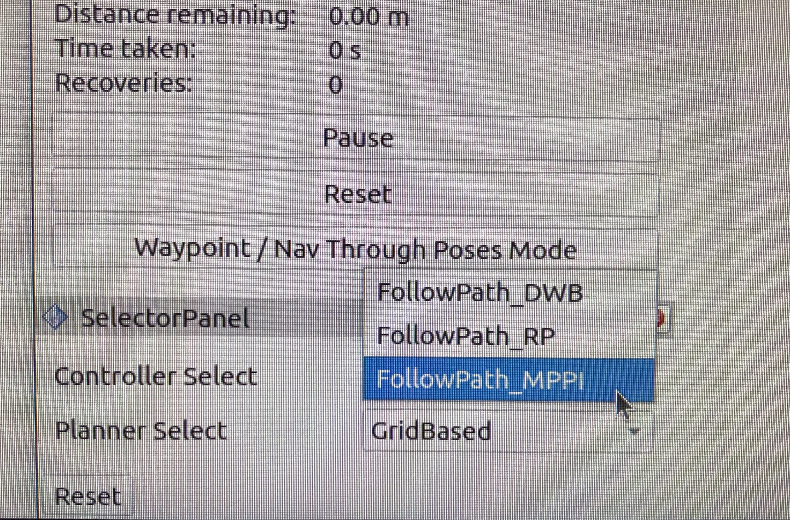

# An rviz2 panel plugin for controller/planner selection

Note: The behavior tree must be configured with a ControllerSelector and PlannerSelector node. Include all controller plugins and parameter definitions in the parameter file.

