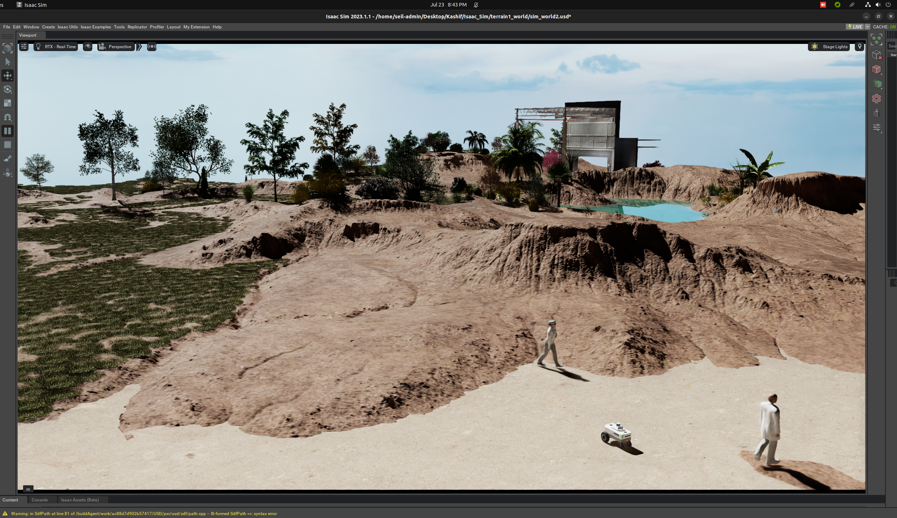
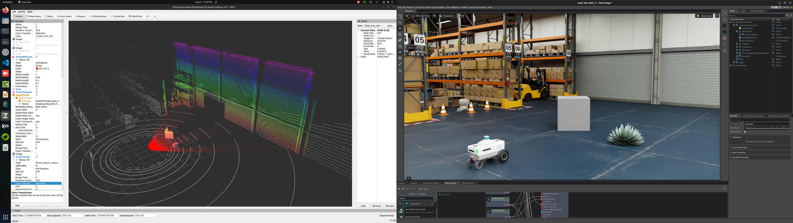

# seil-r2

A ROS 2 colcon workspace holding a ground-robot navigation stack for Isaac Sim: the
Carter baseline running Nav2 with AMCL against an a-priori map, a goal sender that drives
the robot to poses read from a file or sampled on the free space of the map, the service
definitions of the Isaac Sim ROS 2 bridge, and a launch wrapper that starts Isaac Sim
itself as a ROS 2 node. `docker/` holds the container in which the workspace is built and
run.

The workspace targets **ROS 2 Humble** and **Isaac Sim 4.1.0**: `docker/.env.base` sets
`ROS2_DISTRO=humble` and `ISAACSIM_VERSION=4.1.0`, and `src/isaacsim/scripts/run_isaacsim.py`
defaults to Isaac Sim `4.1.0`. ROS 2 lives in the container; Isaac Sim runs from its own
installation, which the `isaacsim` package starts and talks to over DDS.



## What is in the workspace

| package | build type | what it is |
| --- | --- | --- |
| `carter_navigation` | `ament_cmake` | Nav2 bring-up for the Carter robot. `params/carter_navigation_params.yaml` configures AMCL (`nav2_amcl::DifferentialMotionModel`), the NavFn global planner, the DWB local planner, and a local costmap with a voxel layer over the 3D lidar plus two planar obstacle layers. Five launch files: `carter_navigation.launch.py` (Nav2, rviz2, and `pointcloud_to_laserscan` turning `/front_3d_lidar/lidar_points` into `/scan`), `carter_navigation_isaacsim.launch.py` (the same plus Isaac Sim), `carter_navigation_individual.launch.py`, and multi-robot bring-ups for the hospital and office scenes with one parameter file per robot. Five map definitions (three warehouse variants, office, hospital) as YAML with their occupancy images at 0.05 m per pixel, and two rviz2 configurations. |
| `isaac_ros_navigation_goal` | `ament_python` | The `SetNavigationGoal` node: sends `nav2_msgs/NavigateToPose` goals either from a goal file (`assets/*_goals.txt`) or sampled at random, with `obstacle_map.py` reading the map image and YAML so that sampled goals fall in free space. |
| `isaacsim` | `ament_cmake` | `run_isaacsim.py`, a node that launches Isaac Sim as a ROS 2 process: version or install path, DDS implementation, the USD scene to open, standalone script, headless mode, and whether to start the simulation playing. `launch/run_isaacsim.launch.py` exposes each of those as a launch argument. |
| `isaac_ros2_messages` | `ament_cmake` | The five services of the Isaac Sim ROS 2 bridge: `IsaacPose`, `GetPrims`, `GetPrimAttributes`, `GetPrimAttribute`, `SetPrimAttribute`. |
| `custom_message` | `ament_cmake` | `SampleMsg` (a `std_msgs/String` and an `int64`), the sample interface generated in this workspace, used when checking that a custom message crosses the Isaac Sim bridge. |
| `isaac_tutorials` | `ament_cmake` | Two publishers used to drive a robot from outside the simulator — `ros2_publisher.py` (joint states) and `ros2_ackermann_publisher.py` (`AckermannDriveStamped`) — and five rviz2 configurations for the camera, RTX lidar and stereo sensors. |

`src/rviz configs/rviz-depth-nvblox.rviz` is a separate rviz2 configuration for the depth
point cloud described at the end of this file.

## Building

Both images are built from the workspace root (the directory holding `src/`):

```
docker build -f docker/Dockerfile.base -t iddmbse-seil-r2-base .
docker build -f docker/Dockerfile.ros2 -t iddmbse-seil-r2-ros2 .
```

`Dockerfile.base` starts from `ros:humble-ros-base` and installs what the six
`package.xml` files declare: `rosdep install --from-paths src --ignore-src` resolves them
to Nav2 and its plugin packages, rviz2, `pointcloud_to_laserscan`, `rqt_image_view`,
`ackermann_msgs`, `joint_state_publisher` and the Python modules the nodes import
(numpy, Pillow, PyYAML, psutil). `Dockerfile.ros2` copies `src/` on top of that image and
runs

```
colcon build --symlink-install --event-handlers console_direct+
```

so the image comes with the workspace already built and sourced by its entrypoint.

Both builds exited 0 when this release was prepared, giving two images of about 3 GB.
The colcon step, run in a container over the six packages, printed:

```
Summary: 6 packages finished [4.77s]
```

and `ros2 pkg list` inside the container lists them:

```
carter_navigation
custom_message
isaac_ros2_messages
isaac_ros_navigation_goal
isaac_tutorials
isaacsim
```

`ros2 launch -s` parses each launch file in the same container and prints its arguments:
13 for `carter_navigation.launch.py` (`map`, `params_file`, `use_sim_time` and the Nav2
bring-up arguments it forwards), 23 for `carter_navigation_isaacsim.launch.py`, 13 for
`carter_navigation_individual.launch.py`, 15 each for the two multi-robot bring-ups, and
10 for `run_isaacsim.launch.py` (`version` defaulting to `4.1.0`, `install_path`,
`dds_type`, `gui`, `standalone`, `headless`, ...).

To build the workspace by hand inside a container — after editing sources on the host, for
instance:

```
docker run --rm -v "$PWD/src:/workspace/seil-r2/src:ro" iddmbse-seil-r2-base \
    colcon build --symlink-install --event-handlers console_direct+
```

## Running

The stack needs the GPU and an X server for rviz2, and the host network so that ROS 2
reaches Isaac Sim:

```
docker run --rm -it --gpus all --network host \
    -e DISPLAY -v /tmp/.X11-unix:/tmp/.X11-unix \
    iddmbse-seil-r2-ros2 bash
```

Inside the container the entrypoint has sourced `/opt/ros/humble/setup.bash` and the
workspace's `install/local_setup.bash`, so the launch files are directly available:

```
ros2 launch carter_navigation carter_navigation.launch.py
ros2 launch isaac_ros_navigation_goal isaac_ros_navigation_goal.launch.py
```

`carter_navigation_isaacsim.launch.py` additionally starts Isaac Sim through the
`isaacsim` package; it needs an Isaac Sim installation reachable from wherever the launch
runs, and takes the scene as its `gui` argument.

`docker/container.py` wraps the same two images with Docker Compose, including the X11
forwarding and the named volumes that keep the colcon output out of the checkout:

```
python3 docker/container.py start ros2    # build the images and start the container
python3 docker/container.py enter ros2    # open a shell in it
python3 docker/container.py copy ros2     # copy install/ and log/ back to the host
python3 docker/container.py stop ros2     # stop and remove the container
```

The settings the compose file reads are in `docker/.env.base` (ROS 2 distribution, base
image, workspace path in the container, Isaac Sim version) and `docker/.env.ros2` (RMW
implementation, ROS domain, the DDS profile files in `docker/.ros/`).

To build the workspace directly on a machine that already has ROS 2 Humble and the
dependencies:

```
colcon build --symlink-install
source install/local_setup.bash
```

## Depth image and point cloud

The stereo camera on the Carter robot can publish both the 2D depth image and the depth
point cloud, the latter on `depth/ground_truth/point_cloud`. In Isaac Sim, select the
`front_hawk` action graph and its `depth_pcl` output pipeline to enable the point cloud;
the default is the depth image. `src/rviz configs/rviz-depth-nvblox.rviz` loads a view of
that point cloud in rviz2.



The Isaac Sim documentation covers the sensor side of this, including the sensor noise
models for cameras and RTX lidars:

- <https://docs.omniverse.nvidia.com/isaacsim/latest/ros2_tutorials/tutorial_ros2_camera_publishing.html#publish-pointcloud-from-depth-images>
- <https://docs.omniverse.nvidia.com/isaacsim/latest/ros2_tutorials/tutorial_ros2_rtx_lidar.html#multiple-sensors-in-rviz2>
- <https://docs.omniverse.nvidia.com/isaacsim/latest/ros2_tutorials/tutorial_ros2_camera.html#depth-and-other-perception-ground-truth-data>
- <https://docs.omniverse.nvidia.com/isaacsim/latest/ros2_tutorials/tutorial_ros2_python.html#isaac-sim-app-tutorial-ros2-python-camera>

## Origin

The packages under `src/` start from the Carter navigation sample that ships with the
Isaac Sim ROS 2 workspace and keep NVIDIA's copyright headers. The container scripts
`docker/container.py`, `docker/container.sh` and `docker/utils/` come from the Isaac Lab
project under BSD-3-Clause and keep their headers; they are retargeted here at the two
`iddmbse-seil-r2-*` images. The workspace itself is MIT licensed, see `LICENSE`.
