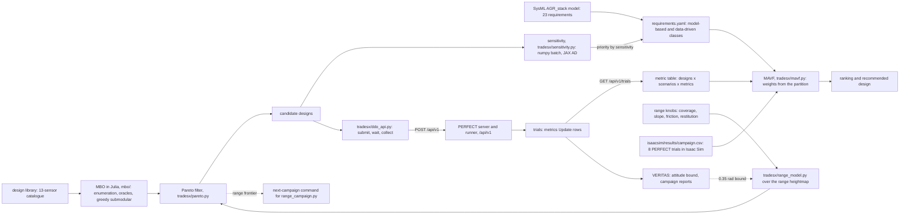
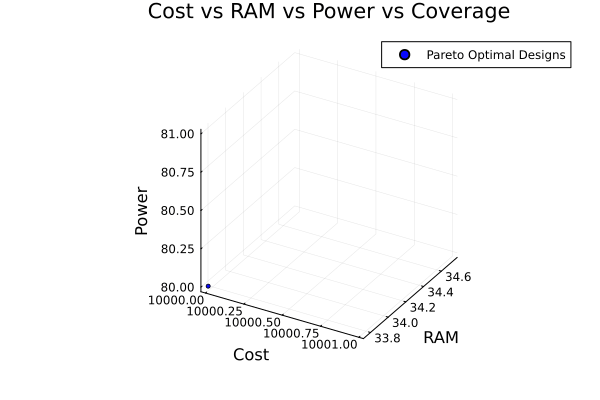

# TRADES-X

TRadeoff Analysis and DEsign Space EXploration, the trade-off stage of the
IDDMBSE tool chain (Section III-C of the IDDMBSE paper, "TRADES-X: Hybrid
Design-Space Exploration"). It takes a design library, a set of requirements
split into model-based and data-driven classes, and a simulation campaign run
by PERFECT, and it produces a Pareto frontier of candidate designs, a
Multi-Attribute Value Function (MAVF) ranking with the recommended design, a
sensitivity ranking of the requirements, and the command line for the next
campaign. It narrows a large design space in two steps:

1. **Model-based optimization (MBO).** Every candidate design is scored by
   first-principles oracles — the parts of the design space that admit a good
   analytical model — and the non-dominated designs are kept. Local metrics for
   the sensor-suite study: effective coverage (maximised), cost, RAM and power
   (minimised).
2. **Data-driven optimization (DDO).** The survivors go into a campaign of
   simulated runs executed by PERFECT, and the metrics come out of the runs:
   how often the design reached its goal, how long it took, how far it
   detoured, how early it saw what was in its way. `tradesx/ddo_api.py` submits
   the campaign to a running PERFECT server over its JSON API and reads the
   trial table back; `tradesx/bag_metrics.py` computes path length, time to
   completion and cumulative elevation gradient from a trajectory.

A Multi-Attribute Value Function (MAVF) then normalises every metric onto
[0, 1] and combines them into a single weighted score, which gives the ranking
and the recommended design.


The paper's overview: system metrics split into model-based and data-driven
ones; the design library feeds MBO, whose pruned Pareto candidates run through
the autonomy stack on the robot's digital twin, and the telemetry from those
runs feeds DDO.

## Architecture

The same two stages serve both studies in this directory: the sensor suite
(a design is a subset of 13 catalogue sensors) and the test range (a design is
a range configuration).



Solid arrows are data the code reads or writes; dashed arrows are a command
line the range study emits and a constant it takes from a VERITAS spec.

## Layout

| path | what it is |
|---|---|
| `tradesx/pareto.py` | vectorised non-dominated filter, plus the MATLAB-compatible variant |
| `tradesx/mavf.py` | SAVF normalisation and weighted-sum MAVF ranking |
| `tradesx/ddo.py` | emits (or runs) the PERFECT CLI sequence for a DDO campaign |
| `tradesx/ddo_api.py` | submits a DDO campaign to a live PERFECT server over `/api/v1`, collects the trials and ranks the designs |
| `tradesx/bag_metrics.py` | path length, time to completion, cumulative elevation gradient from a trajectory |
| `tradesx/sensitivity.py` | the four local oracles in Python (numpy batch, JAX derivatives) and the requirement-sensitivity ranking |
| `tradesx/requirements.py` | loads the model-based / data-driven requirement split |
| `tradesx/range_model.py` | the analytic model of the Isaac Sim test range: rock statistics, start-area grade, traction, contestedness and predicted traversability, numpy or JAX |
| `mbo/` | the Julia MBO package: sensor oracles, enumeration, sensitivity, plots ([README](mbo/README.md)) |
| `mbo/run_mbo.jl` | headless entry point: enumerate, score, write the design evaluations, report the Pareto set, run the greedy search |
| `mbo/src/oracles.jl`, `mbo/src/util_data.jl` | the cost, RAM, power, coverage and effective-coverage oracles; the 13-sensor catalogue |
| `mbo/src/greedy_submodular.jl`; `mbo/src/mbo.jl`, `utilities.jl`, `plotting.jl` | the greedy submodular search; the exploratory script, its plots and the two GIFs |
| `mbo/src/demo_sens.jl`, `mbo/src/sens_fd.jl` | ForwardDiff sensitivities, cross-checked with FiniteDifferences |
| `mbo-matlab-alt/` | MATLAB alternates of the same MBO, kept as reference |
| `pyjulia-example/` | minimal PyJulia call-through stub |
| `case-studies/sensor-suite/` | the ISSE 2024 sensor-suite study and its recorded data ([README](case-studies/sensor-suite/README.md)) |
| `case-studies/sensor-suite/run_case_study.py`, `run_full_enumeration.py` | Pareto filter over the recorded evaluations, MAVF, requirement table, sensitivity ranking; the 8191-design counts in Python |
| `case-studies/sensor-suite/run_ddo_campaign.py` | the data-driven stage against a live PERFECT server |
| `case-studies/sensor-suite/requirements.yaml` | the 23 AGR_stack requirements with their class and stage |
| `case-studies/sensor-suite/{data,results,figures}/` | recorded CSVs, campaign tables, SVG and PDF figures |
| `case-studies/range/` | the test range's own configuration as the design under trade ([README](case-studies/range/README.md)) |
| `case-studies/range/run_range_study.py` | both stages over the range's DOE grid and its eight PERFECT trials |
| `tests/` | pytest suite; `tests/data/perfect_api_recording.json` is a recorded exchange with a live PERFECT server |
| `pyproject.toml`, `uv.lock` | the uv project |

## Install

Python side (uv project, Python >= 3.11):

```
cd trades-x
uv venv
uv sync
uv run pytest -q
```

66 tests pass as of 2026-09-22. The JAX derivatives are an optional extra; add
them with `uv sync --extra ad`. Without it `tests/test_sensitivity.py` skips and
the rest still runs.

If a ROS 2 environment is sourced in your shell, its site-packages lands on
`PYTHONPATH` and pytest tries to auto-load the ament and `launch_testing`
plugins from it. `pyproject.toml` disables those plugins by name so the suite
runs either way; prefixing a command with `env -u PYTHONPATH` keeps the ROS 2
site-packages out altogether.

Julia side (the MBO package has its own project environment):

```
cd trades-x/mbo
julia --project=. -e 'using Pkg; Pkg.instantiate()'
```

`Manifest.toml` was re-resolved on Julia 1.12.7 on 2026-09-22; the environment
precompiles clean and `src/mbo.jl`, `src/sens_fd.jl` and `src/demo_sens.jl` all
run headless. The `SubmodularGreedy.jl` dependency was
dropped, together with `GLMakie`, `VegaLite` and `BenchmarkTools`; see
`mbo/README.md`.

## Quick start

Each step reads files shipped in this directory; none needs a PERFECT stack.

```
cd trades-x
uv sync --extra ad
uv run pytest -q
uv run python case-studies/sensor-suite/run_case_study.py
uv run python case-studies/sensor-suite/run_full_enumeration.py
uv run python case-studies/range/run_range_study.py
uv run python tradesx/ddo.py --dry-run --designs 4234,785,549 --grid 3x3
```

`run_case_study.py` reads the recorded design evaluations, reruns the Pareto
filter, checks the result against the recorded MATLAB output, ranks the
survivors by MAVF and writes the figures. `run_range_study.py` takes about 4 s
on a CPU. The data-driven stage against a live server is under
[Run a DDO campaign](#run-a-ddo-campaign).

## How it connects

| with | what passes | where |
|---|---|---|
| SysML | the 23 `sysml:Requirement` elements of the AGR_stack model, split into the two classes | [`../sysml/models/`](../sysml/models/), [`case-studies/sensor-suite/requirements.yaml`](case-studies/sensor-suite/requirements.yaml) |
| the MATLAB workbench | `prtp`, `MAVF` and the rosbag metrics, ported to Python | [`../sysml/workbench/`](../sysml/workbench/README.md) |
| PERFECT, over the API | the library, designs, scenarios and experiments go in over `POST /api/v1/...`; each trial's `metrics` `Update` row comes back through `GET /api/v1/trials/<id>` | [`tradesx/ddo_api.py`](tradesx/ddo_api.py), [`../perfect/perfect/app/routes/api.py`](../perfect/perfect/app/routes/api.py), [`../perfect/examples/sensor-suite-sim/`](../perfect/examples/sensor-suite-sim/README.md) |
| PERFECT, over the CLI | the same campaign as `flask` commands | [`tradesx/ddo.py`](tradesx/ddo.py) |
| the Isaac Sim range | the heightmap and the eight-trial campaign table go in; the next campaign's command line comes out | [`../isaacsim/range/terrain/heightmap.npz`](../isaacsim/range/terrain/heightmap.npz), [`../isaacsim/results/campaign.csv`](../isaacsim/results/campaign.csv), [`../isaacsim/tools/range_campaign.py`](../isaacsim/tools/range_campaign.py) |
| VERITAS | the range study takes its 0.35 rad attitude bound from the STL observer's spec; VERITAS's data-driven report reads the same sensor-suite campaign database | [`../veritas/runtime/stl-observer/specs/range_safety.yaml`](../veritas/runtime/stl-observer/specs/range_safety.yaml), [`../veritas/datadriven/results/sensor-suite/`](../veritas/datadriven/results/sensor-suite/report.md) |

## Case study: the sensor suite

The study published at ISSE 2024 ([README](case-studies/sensor-suite/README.md)).
A design is any non-empty subset of 13 catalogue sensors. The recorded pipeline
is **4095 -> 96 -> 7**: the cardinality-6 enumeration, its Pareto set, and the
seven designs the published run simulated.

### Model-based stage

To regenerate the design evaluations from the oracles instead of reading the
recorded CSV:

```
cd trades-x/mbo
julia --startup-file=no --project=. run_mbo.jl 6 mbo_design_evals.csv
```

To enumerate the whole design space rather than the cardinality-6 slice, and
reproduce the counts in Python:

```
cd trades-x/mbo
julia --startup-file=no --project=. run_mbo.jl 13 \
  ../case-studies/sensor-suite/data/full_enumeration_4met.csv - \
  ../case-studies/sensor-suite/data/pareto_full.csv
cd ..
uv run python case-studies/sensor-suite/run_full_enumeration.py
```

8191 designs, 120 non-dominated. The case-study README has the counts table
beside the recorded 4095-design run; measured 2026-09-22:

| | designs | standard Pareto | MATLAB-compat Pareto | greedy candidates | greedy frontier |
|---|---|---|---|---|---|
| recorded run, cardinality 6 | 4095 | 96 | 96 | 17 | 11 |
| full enumeration, no cap | 8191 | 120 | 120 | 24 | 15 |

The greedy search spends 454 coverage-oracle calls at cardinality 6 and 1114
with no cap. The JAX sensitivity path and the Julia ForwardDiff one agree to
better than 1e-6 on all four coverage models.

### Data-driven stage through PERFECT

Ten designs (the seven above and three from the full frontier) against
eighteen scenarios on the `perfect/examples/sensor-suite-sim` example: 180
trials, all `TrialState.SUCCESSFUL|SHUT_DOWN`, 4 min 35 s wall on one runner.
The MAVF weights the three model-based attributes 7/23 and the six measured
ones 16/23, from the requirement partition. From
`case-studies/sensor-suite/results/mavf_ddo_ranking.csv`:

| rank | design | MAVF | model-based-only rank | success | time to goal s |
|---|---|---|---|---|---|
| 1 | design-4370 | 0.6732 | 6 | 0.981 | 41.7 |
| 2 | design-4234 | 0.6696 | 7 | 0.991 | 40.9 |
| 3 | design-2185 | 0.6633 | 8 | 0.991 | 40.9 |
| 4 | design-512 | 0.6626 | 4 | 0.88 | 49.8 |
| 5 | frontier-1 | 0.6572 | 2 | 0.824 | 54.4 |
| 6 | frontier-3 | 0.6462 | 3 | 0.861 | 51.3 |
| 7 | design-785 | 0.6286 | 9 | 0.991 | 40.9 |
| 8 | frontier-38 | 0.6217 | 5 | 0.889 | 49.0 |
| 9 | design-549 | 0.6019 | 10 | 0.991 | 40.9 |
| 10 | design-4 | 0.3909 | 1 | 0.44 | 84.9 |

`design-4`, a single D455 depth camera, ranks first on the catalogue
attributes and last once the measured attributes are in. The case-study README
has the full printout, the metric definitions and the figures.

## Run a DDO campaign

`tradesx/ddo.py` turns a list of surviving design ids and a start/goal grid
into the PERFECT CLI sequence:

```
uv run python tradesx/ddo.py --dry-run --designs 4234,785,549 --grid 3x3
```

Every command it emits maps to a real PERFECT CLI command:

| emitted | where it is defined |
|---|---|
| `db init` / `db migrate` / `db upgrade` | Flask-Migrate, registered in `perfect/perfect/app/__init__.py:47` |
| `components load_components` | `perfect/perfect/app/routes/components.py:144` |
| `components load_component_implementations <file>` | `perfect/perfect/app/routes/components.py:138` |
| `designs create <component ids> --name --tag` | `perfect/perfect/app/routes/designs.py:72` |
| `environments create_templates_from_file <file>` | `perfect/perfect/app/routes/environments.py:41` |
| `environments create_from_template <id> k:=v ... --name --tag` | `perfect/perfect/app/routes/environments.py:65` |
| `experiments create <design tag> <env tag> --tag` | `perfect/perfect/app/routes/experiments.py:86` |
| `experiments run <tag>` | `perfect/perfect/app/routes/experiments.py:113` |

`--execute` runs them instead of printing, against a PERFECT stack that is
already up: Redis, an RQ worker, the experiment runner and the Flask server.

The default environment template is PERFECT's `Navigate to Goal Pose`
(`perfect/perfect/common/templates/nav2_operation_plans/navigate_to_goal_pose.json`),
which parametrises `$x_goal` and `$y_goal`. `--start-grid` also emits
`x_start:=` / `y_start:=`, for a template that declares those arguments.

### Over the API, with the results read back

`tradesx/ddo_api.py` does the same thing over PERFECT's JSON API and then
collects what the campaign measured:

| step | route |
|---|---|
| load the sensor library | `POST /api/v1/component_implementations` |
| create the designs | `POST /api/v1/designs` |
| create the scenario template and the scenarios | `POST /api/v1/environment_templates`, `POST /api/v1/environments` |
| create one experiment per design and scenario, each with a trial enqueued | `POST /api/v1/experiments` |
| watch it run | `GET /api/v1/experiments` |
| read the results | `GET /api/v1/experiments/<id>`, `GET /api/v1/trials/<id>` |

Every create route is idempotent on the name, so re-running a submission
against a database that already holds the campaign returns the ids that are
already there. `POST /api/v1/experiments` has no name to be idempotent on, so
`create_experiments` reads the experiments already carrying the tag and creates
only the design-and-scenario pairs that are missing. The HTTP client is
`urllib.request` from the standard library.

An experiment reports what it measured with
`await self._relay_update("metrics", {...})`, which PERFECT stores as an
`Update` row on the trial; `ddo_api.collect` pulls those rows into one row per
trial, `metric_table` folds them into a designs x scenarios x metrics array and
`rank_designs` hands that to the MAVF together with the model-based attributes.
The weights come from the requirement partition in
`case-studies/sensor-suite/requirements.yaml`: the model-based requirements
carry the attributes known from the catalogue before anything runs (price,
power, RAM) and the data-driven ones carry the measured attributes, each class
weighted by how many requirements it holds.

`case-studies/sensor-suite/run_ddo_campaign.py` is the study that uses it, and
`case-studies/sensor-suite/README.md` records a 180-trial campaign against
the `perfect/examples/sensor-suite-sim` example. With a PERFECT stack up on
that example (its [README](../perfect/examples/sensor-suite-sim/README.md) has
the sequence):

```
cd trades-x
uv run python case-studies/sensor-suite/run_ddo_campaign.py --submit --url http://127.0.0.1:5001
uv run python case-studies/sensor-suite/run_ddo_campaign.py --collect --url http://127.0.0.1:5001
```

## Case study: the test range

The same two stages, run on the Isaac Sim test range itself. A range
configuration is the five knobs `isaacsim/tools/range_doe.py` takes (obstacle
coverage, 99th-percentile slope target, static/dynamic friction, restitution),
and it has to be contested enough to tell robot designs apart and traversable
enough that a run produces data.

```
uv run python case-studies/range/run_range_study.py
```

The model-based stage scores all 5616 configurations of the DOE grid with
`tradesx/range_model.py` (encounter chance, mean free path, start-area grade
from the shipped heightmap under the slope target's height scale, no-slip
margin against static friction), prunes them with three model-based
requirements and keeps 68 non-dominated configurations over contestedness and
predicted traversability. The data-driven stage takes the eight trials PERFECT
ran on the range in Isaac Sim (`isaacsim/results/campaign.csv`), checks five
data-driven requirements (distance, roll, pitch, stuck, unstable) and ranks the
eight configurations by MAVF: the terrain's authored relief ranks first on the
model's scores and seventh once the measured attributes are in, since the AGR
rolled to 179° on it. JAX gives the frontier's sensitivity to each knob, and the
eight frontier configurations picked for the next campaign come out as a
`range_campaign.py` command line. `case-studies/range/README.md` has the
tables.

| stage | what the run printed |
|---|---|
| model-based | 5616 configurations; 2079 feasible; frontier of 68 configurations, 32 distinct score pairs |
| data-driven | MAVF 0.6985 (coverage 0.1, slope 25°) first to 0.2971 (coverage 0.8, slope 15°) last |
| sensitivity | largest gap between JAX forward mode and central differences 9.2e-11 |

## Animations



The 96 Pareto-optimal designs of the recorded cardinality-6 run appearing one
by one in cost × RAM × power, marker size by coverage (`mbo/src/utilities.jl`).


The seven designs the published run simulated, which `mbo/src/utilities.jl`
labels the approximate Pareto frontier, one per frame in the same axes.
Running `src/mbo.jl` rewrites both GIFs in place.


The ten sensor-suite designs re-sorting under the MAVF as PERFECT's 180 trials
arrive: `design-4` first on the catalogue attributes, last after the campaign
([card](../demos/README.md)).

## Tests

`uv sync --extra ad` then `uv run pytest -q` from `trades-x/`: 66 tests, all
passing on 2026-09-22.

| file | tests | what it checks |
|---|---|---|
| `tests/test_pareto.py` | 6 | both filters on hand-checked points and against a brute-force oracle, with ties |
| `tests/test_mavf.py` | 4 | MAVF on a hand-checked table, a constant column, the weight and shape checks |
| `tests/test_bag_metrics.py` | 5 | path length, time to completion, elevation gradient |
| `tests/test_ddo.py` | 4 | design-id decoding against `robustness.bash`, the emitted CLI sequence |
| `tests/test_ddo_api.py` | 16 | the campaign driver replayed against a recording of a live PERFECT server |
| `tests/test_requirements.py` | 9 | the 23 requirements and their partition |
| `tests/test_sensitivity.py` | 14 | JAX against the Julia reference values and central differences |
| `tests/test_range_study.py` | 8 | the range model against a brute-force oracle, JAX against central differences, a full run reproducing the shipped results byte for byte |

## Built for this release

These were written for this release on 2026-09-22 and are marked as such
wherever they appear:

- **`mbo/src/greedy_submodular.jl`** — the greedy submodular search. The
  environment carried a `SubmodularGreedy.jl` dependency that no source file
  called and that does not load on Julia 1.12. `mbo_smo_results` was a copy of
  the exhaustive `mbo_results`. Both are now real.
- **The full enumeration.** The recorded run capped designs at 6 sensors, 4095
  of them. `run_mbo.jl 13` enumerates all 8191 and writes
  `case-studies/sensor-suite/data/full_enumeration_4met.csv` and
  `pareto_full.csv`.
- **`tradesx/sensitivity.py`** — the Python/JAX sensitivity path. Only the Julia
  ForwardDiff one existed. The two agree to better than 1e-6 on all four
  coverage models.
- **`case-studies/sensor-suite/requirements.yaml`** and
  **`tradesx/requirements.py`** — the model-based / data-driven requirement
  split, over the 23 SysML requirements of the AGR_stack model. The SysML model
  carries no such split.
- **`tradesx/ddo_api.py`** and
  **`case-studies/sensor-suite/run_ddo_campaign.py`** — the data-driven stage
  against a live PERFECT server, with the PERFECT example it runs on at
  `perfect/examples/sensor-suite-sim`.
- **`tradesx/range_model.py`** and **`case-studies/range/`** — the test range
  as the design under trade.

## Provenance

- `mbo/`, `mbo-matlab-alt/` and `pyjulia-example/` were moved out of
  `perfect/perfect_MBO/` and `perfect/pyjulia_example/` on 2026-09-22.
  `run_mbo.jl` and this README are new, and `mbo/README.md` was rewritten to
  describe the enumeration, the oracles and the greedy submodular search that
  the code actually implements. The Julia sources came over unchanged
  and were then edited, the same day, to run on Julia 1.12 without a display:
  `mbo.jl` (headless GR, the greedy call, a stray backtick literal removed, two
  forward references fixed), `utilities.jl` (a forward reference fixed),
  `plotting.jl` (GLMakie to CairoMakie), `sens_fd.jl` (a broken
  `FiniteDifferences.forward_fdm` call replaced by real gradients) and
  `demo_sens.jl` (its results printed rather than discarded).
- `tradesx/pareto.py` and `tradesx/mavf.py` are ports of `prtp` and `MAVF` from
  the MATLAB workbench now at `sysml/workbench/` (`dse/pareto.m`,
  `rosbag/MBO_rosbag_evals.m`).
- `tradesx/bag_metrics.py` is a port of the metric computations in
  `sysml/workbench/rosbag/*.m`.
- `tradesx/ddo.py` is a port of `examples/SEILR1/robustness.bash`, updated from
  the old `simulations` command group to today's `experiments`. That bash script
  was updated to the current command names on 2026-09-22.
- `tradesx/ddo_api.py` is new on 2026-09-22 and talks to the `/api/v1`
  blueprint in `perfect/perfect/app/routes/api.py`.
- `mbo/SubmodularGreedy.jl Tutorial.ipynb` is the tutorial of the upstream
  package (github.com/crharshaw/SubmodularGreedy.jl), kept as the reference for
  the oracle convention `greedy_submodular.jl` follows.

## License

MIT, the repository's [LICENSE](../LICENSE).

## Citation

The sensor-suite case study:

> S. Damera, P. Kumar, J. S. Baras. Integrated Data-Driven and Model-Based
> Trade-off Analysis of Sensor Suite System for Autonomous Ground Vehicle
> Navigation. INCOSE International Symposium / ISSE, 2024.

The methodology:

> J. S. Baras, S. Damera, R. Matheu, M. Enwerem, P. Kumar. IDDMBSE:
> Integrating Data-Driven and Model-Based Systems Engineering for Trusted
> Autonomous Cyber-Physical Systems. ISSE, 2026.
