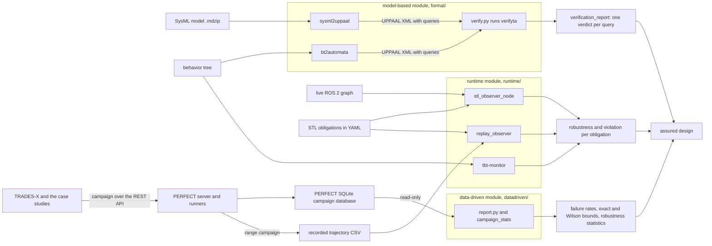
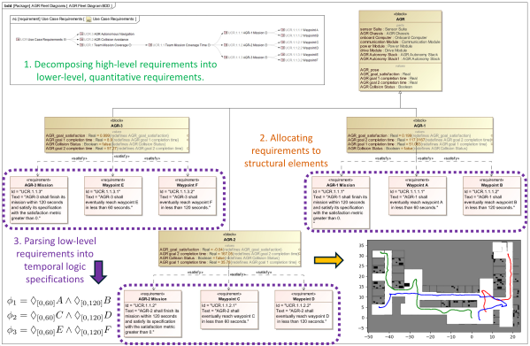

# VERITAS

VERIfication of Trusted Autonomous Systems — the assurance layer of IDDMBSE, Section III-D of
the paper ("VERITAS: Three-Module Verification of Trusted Autonomy"). It takes a design
candidate and its requirements in three forms — a SysML model or a behavior tree, a PERFECT
campaign database, and the signals of the running stack (a live ROS 2 graph or a recorded
trajectory) — and returns, one module each, UPPAAL proof verdicts, failure rates with exact
confidence bounds and STL robustness statistics, and a robustness value and a violation flag
per obligation at every monitor step.


The paper's pipeline: a candidate and its formalised requirements go through model checking,
statistical evidence from PERFECT campaigns and online monitoring, and it counts as an assured
design only once it passes all three. Here the model checker is UPPAAL and the online monitors
are built on RTAMT.

## The three modules

The paper describes three modules: a **model-based** module that compiles SysML state-machine
and activity diagrams into UPPAAL networks of timed automata; a **data-driven** module that
uses PERFECT simulation campaigns to estimate failure rates and confidence bounds; and a
**runtime** module that synthesizes STL/MITL monitors for the deployed stack. For behavior
trees it uses automated model generation (BT2Automata, HSCC 2025) and online monitor synthesis
(OMTBT, ECC 2025) directly from BT specifications, the formal models "for verification of task
plans and formal control synthesis in UPPAAL" and the online monitors "for quantitative task
monitoring and to provide feedback for learning-based controllers".

Two kinds of code sit here. Three code bases are **vendored** from two of the coauthors'
research repositories at pinned commits (see [`ATTRIBUTION.md`](ATTRIBUTION.md)) and cover the
behavior-tree half of the paper. Four more were **written for this release**: the SysML front
end of the model-based module, the model-checker driver that runs both front ends' output
through UPPAAL, the data-driven module, and the deployed-stack observer of the runtime module.

| module in the paper | what is here | origin | what it does |
|---|---|---|---|
| model-based | `formal/sysml2uppaal/` | written for this release | compiles SysML state machines and activities out of a MagicDraw `.mdzip` into an UPPAAL network of timed automata, and turns requirements into proof obligations in its queries block |
| model-based | `formal/bt2automata/` | vendored, HSCC'25 | composes a behavior tree into a UPPAAL network of timed automata, for model checking and control synthesis |
| model-based | `formal/verify.py` | written for this release | runs `verifyta` over either generator's model, extracts its queries into a `.q` file, parses the per-query verdicts and writes a verification report |
| data-driven | `datadriven/` | written for this release | failure rate, Clopper-Pearson and Wilson confidence bounds, campaign-size design and post-hoc STL robustness statistics over a PERFECT campaign, read straight out of PERFECT's SQLite database, with a report tool and a figure |
| runtime | `runtime/stl-observer/` | written for this release | a generic-subscriber ROS 2 node that watches the deployed stack against STL obligations written in YAML, publishes robustness and a violation flag per obligation, and logs an alarm; plus the same monitors over a recorded trajectory |
| runtime | `runtime/tbt-monitor/` | vendored, ECC'25 | greedy online monitor for a behavior tree, with RTAMT STL leaf specifications; returns a quantitative robustness and a three-valued node state at every step |
| control synthesis | `synthesis/ltbt/` | vendored | three-valued (Kleene) encodings of temporal behavior trees as Gurobi MILP constraints, and trajectory-synthesis scripts built on them |

The multi-robot STL/MILP demonstration is in
[`case-studies/B3-assured-multi-robot/`](../case-studies/B3-assured-multi-robot/README.md).

## Architecture



Everything left of the modules is a file or a process owned by another part of the repository:
the SysML model in [`../sysml/`](../sysml/models/LINEAGE.md), PERFECT's database written by the
campaigns in [`../perfect/`](../perfect/README.md), the trajectories written by the range trials
in [`../isaacsim/`](../isaacsim/README.md). VERITAS only reads them.

## Directory map

| path | what it holds |
|---|---|
| `formal/sysml2uppaal/` | `sysml2uppaal.py`, the translator and its command line; `demo_battery.py`, the mk6 battery demo |
| `formal/bt2automata/` | `bt2ta/bt2ta.py` (the composition algorithms), `leaf_node_templates.xml` (the leaf automata), `demo.py` |
| `formal/verify.py` | the UPPAAL driver: query extraction, `verifyta` lookup and run, verdict parsing, the report |
| `formal/animations/` | `make_bt_to_automaton.py`, `nta_layout.py`, `uppaal_verdicts.json`, and the rendered `bt_to_automaton.{mp4,gif}` with its poster |
| `datadriven/campaign_stats.py` | failure rate, Clopper-Pearson, Wilson, campaign-size design, robustness statistics with the DKW correction |
| `datadriven/perfect_adapter.py` | reads a campaign out of PERFECT's SQLite database (read-only) or a CSV export |
| `datadriven/report.py` | the report tool: groups, tables, `report.{json,md,csv}`, `failure_rates.{svg,pdf}` |
| `datadriven/demo_campaign.py` | the dummy-database and synthetic-campaign demo |
| `datadriven/results/` | the reports over the campaigns run here: `sensor-suite/`, `range/`, `rarrt/`, `conformal/`, `multirobot/` |
| `runtime/stl-observer/` | `monitors.py` (the STL monitors built from a YAML spec, no ROS), `stl_observer_node.py` (the ROS 2 node), `replay_observer.py` (the same monitors over CSV traces), `test_publisher.py`, `demo_range_trace.py` |
| `runtime/stl-observer/specs/` | `agr_safety.yaml` (the live spec), `range_safety.yaml` (the range trajectory spec) |
| `runtime/stl-observer/results/range/` | `verdicts.{md,csv}` and `robustness.{svg,pdf}` over the eight range trajectories |
| `runtime/tbt-monitor/` | `tbt_monitor.py`, `panda_specifications.py`, `demo_synthetic.py`, `main.py`, `tqc_pandp.zip` (the trained policy, 24 MB) |
| `synthesis/ltbt/` | `ltbt/boolean.py`, `ltbt/ternary.py`, `robot.py`, `robot2.py`, `multiagent.py`, `multiagent2.py`, `plot.py`, `plot2.py`, `plot3.py`, and the saved solutions under `robot/` |
| `tests/` | nine test files, `fake_verifyta.py` (a stub `verifyta`) and `conftest.py` |
| [`docs/module-notes.md`](docs/module-notes.md) | the full walk-through of every module and of every test file |
| `ATTRIBUTION.md`, `pyproject.toml`, `uv.lock` | where the vendored code comes from; the uv project and its lock |

## Install

This is a self-contained uv project on Python 3.10 (the upstream pins need it).

```
cd veritas
uv venv --python 3.10
uv sync
```

That gives 23 packages on CPython 3.10.20. Two optional extras, neither needed by any demo
below except the last one:

```
uv sync --extra rl      # torch, stable-baselines3, panda-gym — for the RL rollout
uv sync --extra milp    # gurobipy, scipy, matplotlib — for the synthesis scripts
```

`uv sync` makes the environment exact, so the two extras replace each other unless you ask for
both at once (`uv sync --extra rl --extra milp`).

**If you have a ROS 2 environment sourced**, `PYTHONPATH` points at ROS's `site-packages`,
pytest autoloads ROS's `launch_testing` plugin into this Python 3.10 venv and the run dies with
`ModuleNotFoundError: No module named 'yaml'`. Prefix the commands with `env -u PYTHONPATH`, or
open a shell with ROS not sourced. Everything here runs without ROS, **except** the observer
node `runtime/stl-observer/stl_observer_node.py`, which needs `rclpy` and therefore runs in
ROS's own Python — see the runtime module below, which is the one place the two environments
meet.

UPPAAL is free for non-commercial academic use and is downloaded separately: get it from
<https://uppaal.org/downloads/> and register for an academic key at
<https://uppaal.veriaal.dk/>.

## Quick start

From `veritas/`, one command per module, each copied from its section below:

```
env -u PYTHONPATH uv run pytest -q
uv run python formal/sysml2uppaal/demo_battery.py
uv run python formal/bt2automata/demo.py
export UPPAAL_HOME=/path/to/your/uppaal
uv run python formal/verify.py formal/sysml2uppaal/battery_sm.xml formal/bt2automata/BT_converted.xml
uv run python datadriven/demo_campaign.py
uv run python datadriven/report.py --db datadriven/demo_out/campaign.db --out datadriven/demo_out
uv run python runtime/stl-observer/demo_range_trace.py
uv run python runtime/stl-observer/replay_observer.py \
    runtime/stl-observer/demo_out/range_trajectory.csv \
    --spec runtime/stl-observer/specs/range_safety.yaml --every 200
uv run python runtime/tbt-monitor/demo_synthetic.py
```

## Model-based module — `formal/`

**SysML to UPPAAL.** `uv run python formal/sysml2uppaal/demo_battery.py` reads
`sysml/models/AGR_stack-MB-SensorTrade-mk6.mdzip` (read-only; the demo checks the file's md5 is
unchanged), translates its one state machine and the small `Demo AD` activity, and writes
`battery_sm.xml` next to the script: one template `ee_hv_battery_charge_discharge` with five
locations and five edges, and one template `Demo_AD` with four locations and four edges — 2
templates, 9 locations, 9 edges and 12 queries in all, with four warnings about the source
model. Of the 23 requirements in the model, two become proof obligations:

```
A[] current_soc > 60    // P.1.4 AGR Battery State of Charge: "The AGR Battery State of Charge
                        //   during operation shall always be more than 0.6."
A[] gt < 180            // P.1.2 Time to Completion: "The AGR shall complete the entire path in
                        //   the test environments in less than 180 seconds."
```

plus `A[] not deadlock` and one `E<> …` reachability query per location. A real variable is
scaled to an integer by a documented factor (default 100), so `current_soc < 0.6` becomes
`current_soc < 60`. The translator is also a command-line tool for any other model:

```
uv run python formal/sysml2uppaal/sysml2uppaal.py model.mdzip out.xml --scale 100
```

**Behavior tree to UPPAAL.** `uv run python formal/bt2automata/demo.py` composes the tree
`Sequence(FA, Sequence(Selector(CBatt, FCharger), FB))` — *go to A; if the battery is low go to
the charger first; then go to B* — into `BT_converted.xml`, a UPPAAL NTA with the templates
`BT`, `Battery` and `Grid`, instantiated as `spec=BT(20)`, `battery=Battery(75)`, `grid=Grid()`,
and the two queries `E<> spec.Success` and `E<> spec.Failure`. Its md5 is
`96b2e35c435ce771191351242e29cb77`, and `9f1da760f65674818d156546092e6118` with the DOCTYPE
line removed, which is the upstream output byte for byte.

**Checking the models.** `verify.py` reads each model's `<queries>` block, writes it beside the
model as a `.q` file, finds `verifyta` (`--verifyta`, then `$UPPAAL_HOME/bin-Linux/verifyta`,
then `$UPPAAL_HOME/bin/verifyta`, then `PATH`), runs `verifyta -t0 MODEL QUERIES`, and writes
`verification_report.json` and `verification_report.md`. With no UPPAAL on the machine it
prints one line saying to set `UPPAAL_HOME` and exits 2.

**What UPPAAL 5.0.0 printed here.** Both models, one driver run each, `verifyta -t0` with the
extracted query file: 12 queries on the battery model in 0.02 s, 2 queries on the behavior-tree
model in 0.28 s.

| # | query | requirement | verdict |
|---|---|---|---|
| 1 | `A[] gt < 180` | P.1.2 Time to Completion | not satisfied |
| 2 | `A[] current_soc > 60` | P.1.4 AGR Battery State of Charge | satisfied |
| 3 | `A[] not deadlock` | structural | satisfied |
| 4 | `E<> ee_hv_battery_charge_discharge_p.Pseudostate` | reachability | satisfied |
| 5 | `E<> ee_hv_battery_charge_discharge_p.Operational` | reachability | satisfied |
| 6 | `E<> ee_hv_battery_charge_discharge_p.Enter_Power_Saving_Mode` | reachability | not satisfied |
| 7 | `E<> ee_hv_battery_charge_discharge_p.Charging` | reachability | not satisfied |
| 8 | `E<> ee_hv_battery_charge_discharge_p.Quick_Charge_Complete` | reachability | not satisfied |
| 9 | `E<> demo_ad_p.InitialNode` | reachability | satisfied |
| 10 | `E<> demo_ad_p.Opaque_Action_Matlab_Script` | reachability | satisfied |
| 11 | `E<> demo_ad_p.Opaque_Action_Python_Script` | reachability | satisfied |
| 12 | `E<> demo_ad_p.MergeNode` | reachability | satisfied |

and on `BT_converted.xml`, `E<> spec.Success` satisfied and `E<> spec.Failure` satisfied —
the first witnesses a trace in which the robot completes the task, the second a trace in which
it does not, which is what the upstream comment says the two queries demonstrate.

What that table says about the SysML model is the point of the exercise. **P.1.4 holds for an
uninteresting reason**: the only assignments to `current_soc` set it to 70, and the only guard
that would leave `Operational` needs `current_soc < 60`, so nothing in the authored state
machine ever lowers the state of charge and the safety property holds vacuously. Queries 6, 7
and 8 are the same finding seen from the other side: the three states behind that guard —
`Enter_Power_Saving_Mode`, `Charging`, `Quick_Charge_Complete` — are unreachable, so the
battery discharge the diagram draws is never exercised. **P.1.2 fails** because the battery
machine has no notion of completing a path: `gt` runs on without bound, and UPPAAL returns the
trace that delays 180 time units in the initial state. The query is there to show that a
time-bounded requirement maps onto `gt` rather than onto a scaled integer.

The supported SysML fragment, the four warnings, the pyuppaal round-trip trap and the driver's
options are in [the module notes](docs/module-notes.md#1-sysml-to-uppaal--formalsysml2uppaal).

## Data-driven module — `datadriven/`

```
uv run python datadriven/demo_campaign.py
uv run python datadriven/report.py --db datadriven/demo_out/campaign.db --out datadriven/demo_out
```

`campaign_stats.py` is the estimation (failure rate, the exact Clopper-Pearson interval and its
one-sided upper bound, the Wilson interval, `trials_for_upper_bound` for campaign-size design,
and post-hoc STL robustness statistics with a DKW-corrected quantile), all whole-array numpy.
`perfect_adapter.py` gets the campaign out of PERFECT, `demo_campaign.py` runs both on PERFECT's
own dummy example and on seeded synthetic campaigns, and `report.py` is the tool you point at a
campaign database of your own; it writes `report.json`, `report.md`, `report.csv` and the
figure pair `failure_rates.svg` / `failure_rates.pdf`.

**What the demo prints.** On `perfect/examples/dummy/dummy.db` — one trial, state
`TrialState.SUCCESSFUL|SHUT_DOWN`, `start_age` 15.025 s — the table is degenerate and the point
of printing it is to show how little one trial buys: failure rate 0, but the exact upper bound
is 1 − 0.05^(1/1) = 0.95, and it takes 59 zero-failure trials before that bound reaches 0.05.
On the synthetic campaign of 200 trials (each draws a robustness from N(0.15, 0.12) and fails
exactly when it is negative, so the true failure probability is Φ(−1.25) = 0.10565) the
estimate is 0.085 from 17 failures, with the exact interval [0.0503, 0.1326], which contains
the truth, and the Wilson interval [0.0537, 0.1319] inside it. The same campaign at 2000 trials
gives 204 failures, rate 0.102, exact [0.0891, 0.1161], and is where the DKW band finally
becomes narrower than a 5% quantile level (it takes 738 trials): the empirical 5% quantile of
the robustness is −0.0526 and its DKW-corrected value −0.1133.

The demo then writes `datadriven/demo_out/campaign.db`, a campaign in PERFECT's own schema —
two designs across two environments, 60 trials each, 240 trials and 12 failures in all — and
`report.py` on it gives:

| design | environment | trials | failures | rate | exact interval | exact upper | trials for 0.05 |
|---|---|---|---|---|---|---|---|
| AGR + A-star | range dense | 60 | 3 | 0.05 | [0.0104, 0.1392] | 0.1242 | 153 |
| AGR + A-star | range sparse | 60 | 1 | 0.0167 | [0.0004, 0.0894] | 0.0766 | 93 |
| AGR + Dijkstra | range dense | 60 | 6 | 0.1 | [0.0376, 0.2051] | 0.1879 | 234 |
| AGR + Dijkstra | range sparse | 60 | 2 | 0.0333 | [0.0041, 0.1153] | 0.1012 | 124 |

with the robustness table beside it (mean 0.2037 / 0.2996 / 0.1295 / 0.2262 per group, 5%
quantiles 0.0403 / 0.1026 / −0.0123 / 0.0237, and the DKW correction reporting −inf at 60
trials per group, which is the honest answer at that campaign size). On PERFECT's dummy
database the same command reports its one group: 1 trial, 0 failures, exact [0.0, 0.975], upper
bound 0.95, 59 trials to reach the 0.05 target.

How the adapter reads PERFECT's schema and what each statistic guarantees:
[the module notes](docs/module-notes.md#4-failure-rates-and-confidence-bounds-over-a-perfect-campaign--datadriven).

## Runtime module — `runtime/`

**The STL observer.** `stl_observer_node.py` is a generic subscriber: the message type is a
string in the YAML spec, resolved at run time, so adding a signal on a new topic of a new type
is an edit to the YAML and nothing else. It publishes `std_msgs/Float64` on
`/veritas/<monitor>/robustness` and `std_msgs/Bool` on `/veritas/<monitor>/violation`.
`specs/agr_safety.yaml` carries three obligations, two of them from requirements in the SysML
model, quoted verbatim in the file:

| monitor | requirement | formula | signal |
|---|---|---|---|
| `soc_safety` | P.1.4, "…state of charge…shall always be more than 0.6" | `historically (soc >= 0.6)` | `/battery_state` `sensor_msgs/msg/BatteryState.percentage` |
| `goal_liveness` | P.1.2, "…shall complete the entire path…in less than 180 seconds" | `once[0,180] (goal >= 0.5)` | `/goal_reached` `std_msgs/msg/Bool.data` |
| `obstacle_safety` | a local safety obligation | `historically (obstacle_distance >= 0.5)` | `/obstacle_distance` `std_msgs/msg/Float64.data` |

The node needs `rclpy`, so it runs in ROS's Python; RTAMT goes into a directory of your own on
`PYTHONPATH` (never into the system Python or into `/opt/ros`):

```
uv pip install --python /usr/bin/python3 --target /tmp/veritas-ros-deps 'rtamt==0.3.5' 'antlr4-python3-runtime==4.7'
source /opt/ros/jazzy/setup.bash
export PYTHONPATH=/tmp/veritas-ros-deps:$PYTHONPATH
export ROS_DOMAIN_ID=87 RMW_IMPLEMENTATION=rmw_fastrtps_cpp ROS_LOCALHOST_ONLY=1
python3 runtime/stl-observer/stl_observer_node.py --spec runtime/stl-observer/specs/agr_safety.yaml --duration 34
```

and, in a second shell with the same environment, the synthetic scenario the spec is written
against — the state of charge decays linearly through 0.6 at t = 20 s, the goal is reached at
t = 28 s, the obstacle distance never drops below 0.8:

```
python3 runtime/stl-observer/test_publisher.py --duration 32
```

**What that run printed.** On ROS 2 Jazzy, domain 87, the observer logged `VIOLATION
soc_safety [P.1.4] at t=19.9s robustness -0.0015`; the robustness topic ran 0.0045, 0.0030,
0.0015, 0.0000, −0.0015 through the crossing and the violation topic flipped false → true on
the same sample. All six `/veritas/<monitor>/{robustness,violation}` topics were on the graph
beside the three input topics. `goal_liveness` published −0.5 for 56 samples and then +0.5 for
75, and reported no violation, because its warmup is 180 s.

**Replaying instead.** `replay_observer.py` runs the same monitors over recorded CSVs inside
this venv, with no ROS. `specs/range_safety.yaml` is written against the range trial's
trajectory CSV (`t,x,y,z,roll,pitch,yaw,v`, 60 Hz), samples at 20 Hz, and carries `historically
(abs(roll) <= 0.35)`, `historically (abs(pitch) <= 0.35)` and `eventually[0,20] (v >= 0.2)`
with a 20 s warmup. `demo_range_trace.py` writes a 3600-row trace to run it against (60
simulated seconds at 0.6 m/s, a slope that tilts it to 0.4024 rad in pitch at about 22 s, then
0.02 m/s from 25 s to 50 s):

```
uv run python runtime/stl-observer/demo_range_trace.py
uv run python runtime/stl-observer/replay_observer.py \
    runtime/stl-observer/demo_out/range_trajectory.csv \
    --spec runtime/stl-observer/specs/range_safety.yaml --every 200
```

Over that trace's 1200 monitor samples the three verdicts are: `roll_safety` holds throughout,
its robustness settling at 0.2; `pitch_safety` first violated at sample 429, monitor time
21.45 s, robustness −0.0006 and then −0.0522 for the rest of the run; and `progress` first
violated at sample 900, monitor time 45.0 s, robustness −0.18 — exactly 20 seconds, one window,
after the robot stopped, recovering to 0.4 when it moves again at 50 s.

**The behavior-tree monitor.** `uv run python runtime/tbt-monitor/demo_synthetic.py` runs the
monitor on a hand-made pick-and-place trace, `Sequence(reach object, grasp, reach goal)`, and
prints `(rho, state)` at every step: the trace that reaches, grasps and places ends at `state 1`
(success) with `rho 0.012`; the trace whose gripper never closes stays at `state 0` (running)
with `rho -0.03`. The RL rollout the OMTBT paper reports is `main.py`, with the `rl` extra:

```
uv sync --extra rl
uv run python runtime/tbt-monitor/main.py --n-rollouts 2 --no-video
```

Here it ran headless in 14.0 s and printed `Success Rate: 1.0`.

The node's sampling and warmup rules, the RTAMT operator conventions and the monitor's
three-valued semantics: [the module notes](docs/module-notes.md#5-the-stl-observer--runtimestl-observer).

## Control synthesis — `synthesis/ltbt/`

```
uv sync --extra milp
cd synthesis/ltbt && uv run python robot.py
```

`ltbt/boolean.py` and `ltbt/ternary.py` encode temporal behavior trees as gurobipy constraints,
two-valued and three-valued. These scripts need a full Gurobi license; they exceed the
size-limited license that ships with pip `gurobipy` (`robot.py` is 4190 variables and 2292
constraints, and a quadratic objective caps that license at 200 variables). Runtimes recorded
in the upstream solver logs, on the author's machine: 22.96 s and objective 1.1243 for
`robot2.py` (341 rows by 2888 columns), and 309.42 s (objective 7.9662) and 790.00 s (objective
12.3665) for two multi-agent runs of 901 rows by 2394 columns. `plot.py` on the saved `robot/`
solutions wrote a 1-page 166 KB PDF here. The scripts one by one:
[the module notes](docs/module-notes.md#7-milp-synthesis-from-temporal-behavior-trees--synthesisltbt).

## Over the campaigns run here

The data-driven and runtime modules pointed at the campaigns the rest of this repository ran,
with every PERFECT database opened read-only. The full tables, the commands and what each
break means are in [`docs/results.md`](docs/results.md).

| campaign | module and failure criterion | trials | what it printed | output |
|---|---|---|---|---|
| sensor-suite, run for [TRADES-X](../trades-x/case-studies/sensor-suite/README.md) | `report.py`; a trial fails when any of its twelve draws missed the goal | 180 in 10 designs | 48 failures; rates 0.0556 to 0.6111; 93 to 361 trials each before a 95% upper bound reaches 0.05 | `datadriven/results/sensor-suite/` |
| [Isaac Sim range](../isaacsim/README.md) | `replay_observer.py` with `specs/range_safety.yaml` | 8 trajectories | `roll_safety` violated on 2 traces (at 29.85 s and at 0.0 s), `progress` on 1 (at 25.7 s), `pitch_safety` on none, tightest pitch margin 0.031 rad | `runtime/stl-observer/results/range/` |
| Isaac Sim range | `report.py`; a trial fails under 5 m covered in its 30 s | 8 design points | 2 failures, the two traces the observer flagged; exact [0.0, 0.975] and 59 trials for 0.05 at the six that cleared it | `datadriven/results/range/` |
| [RA-RRT* planning](../case-studies/A2-risk-sensitive-planning/README.md) | `report.py`; a trial fails when any of its 400 executions went over the traversal budget | 300 in 5 policies | rates 0.5333 (cvar0.5) to 0.6167 (rrtstar); 855 to 968 trials for 0.05 | `datadriven/results/rarrt/` |
| [conformal calibration](../case-studies/B2-conformal-perception/README.md) | `report.py`; a trial fails when its episode ended in a collision | 270 in 3 detectors | rates 0.5667 (sharp) to 0.9222 (degraded); 1282 to 1985 trials for 0.05 | `datadriven/results/conformal/` |
| [assured multi-robot](../case-studies/B3-assured-multi-robot/README.md) | `report.py`; a trial fails when its executed min rho is below zero | 162 with an executed trace, in 18 designs | 52 failures; rates 0.0 to 1.0 (alloc120-m0.15); 59 to 311 trials for 0.05 | `datadriven/results/multirobot/` |

## How it connects

| from | to VERITAS | contract | files |
|---|---|---|---|
| SysML model | model-based and runtime modules | the `.mdzip`'s UML 2.5 XMI, read-only; requirements P.1.4 and P.1.2 become UPPAAL queries and STL obligations | [`sysml/models/`](../sysml/models/LINEAGE.md), `formal/sysml2uppaal/`, `runtime/stl-observer/specs/agr_safety.yaml` |
| PERFECT | data-driven module | PERFECT's SQLite database opened read-only: `trial` joined to `experiment`, `design` and `environment`; the outcome from `trial.state` or from a per-trial number in the `update` table | [`perfect/README.md`](../perfect/README.md), `datadriven/perfect_adapter.py` |
| TRADES-X | data-driven module | the sensor-suite campaign TRADES-X's data-driven stage submitted over `/api/v1`; VERITAS reads the database of the campaign whose trial table TRADES-X ranks by MAVF | [`trades-x/case-studies/sensor-suite/README.md`](../trades-x/case-studies/sensor-suite/README.md) |
| Isaac Sim range | runtime module | the trajectory CSV each range trial writes, `t,x,y,z,roll,pitch,yaw,v` at 60 Hz, against `specs/range_safety.yaml` | [`isaacsim/README.md`](../isaacsim/README.md), `runtime/stl-observer/replay_observer.py` |
| ROS 2 stack | runtime module | any topic named in the YAML spec, subscribed by message-type string; `/veritas/<monitor>/{robustness,violation}` out | `runtime/stl-observer/stl_observer_node.py` |

The multi-robot demonstration of the paper's case studies closes the loop the other way: each
robot's executed trace is scored with the quantitative STL robustness and the value is written
back into the fleet model as the robot block's goal satisfaction, a negative value flagging the
violation.



The paper's multi-robot figure: fleet requirements become per-robot reach-avoid STL
specifications, the MILP plans are executed, and each trace's robustness is written back into
the model. [`case-studies/B3-assured-multi-robot/`](../case-studies/B3-assured-multi-robot/README.md)
implements that chain, with its robustness evaluator checked against RTAMT.

## Animations


The model-based module: the demo behavior tree becoming its UPPAAL network, then the battery
state machine with the UPPAAL 5.0.0 verdicts colouring its locations.

The two scenes, the layout and where the verdicts come from:
[the module notes](docs/module-notes.md#the-behavior-tree-animation).

```
export UPPAAL_HOME=/path/to/your/uppaal    # optional
uv run python formal/animations/make_bt_to_automaton.py --out formal/animations
```

The render needs `dot` and `ffmpeg` on the `PATH`. It took 16.7 s here, and a second render gave
the same 600 frames and byte-identical poster files. `tests/test_animation.py` checks the reader
and the layout on the demo network, that the recorded verdicts belong to the demo's queries,
and that the script writes its four files.


The runtime module: the eight range traverses replayed together, each with the observer's
roll, pitch and progress lamps turning red at the first-violation times in
`runtime/stl-observer/results/range/verdicts.csv` ([card](../demos/README.md#range_replay)).


The multi-robot study: the executed traces, the separation breach at step 8, and each robot's
STL robustness falling to the value written back into the fleet model
([card](../demos/README.md#multirobot_room)).

## Tests

```
uv run pytest -q
```

(again, prefix with `env -u PYTHONPATH` if you have ROS 2 sourced). The suite is 66 passed and
2 skipped in 5.1 s — the two skips are the Gurobi solve, which needs the `milp` extra, and the
real-`verifyta` check, which runs as a 67th test when `UPPAAL_HOME` points at an UPPAAL install
(67 passed, 1 skipped in 5.9 s). The Clopper-Pearson endpoints are checked against
`scipy.stats.binom` as an independent oracle, and on coverage: at n = 20, δ = 0.05 the exact
interval's worst-case coverage over p is 0.958 and Wilson's is 0.8605; the Wilson upper endpoint
(≈ z²/n = 3.8415/n) overtakes the exact one (≈ ln(2/δ)/n = 3.6889/n) at k = 0 and large n. The
STL monitors are checked against closed-form oracles for their operators; the SysML translator
against the 23 requirements and the five locations and transitions of the mk6 model. What each
test file checks: [the module notes](docs/module-notes.md#what-each-test-checks).
Every command on this page and what it printed here, in one table:
[`docs/results.md`](docs/results.md#what-runs-here).

## Provenance

| part | origin |
|---|---|
| `formal/bt2automata/` (`bt2ta/bt2ta.py`, `leaf_node_templates.xml`) | vendored from `github.com/rymatheu/hscc25-rp` at `e63fa448`, the HSCC'25 repeatability package; `demo.py` replaces the upstream `main.py` |
| `runtime/tbt-monitor/` (`tbt_monitor.py`, `panda_specifications.py`, `main.py`, `tqc_pandp.zip`) | vendored from the same repository and commit; `main.py` edited for paths and a `--no-video` flag |
| `synthesis/ltbt/` | vendored from `github.com/rymatheu/ltbt` at `6f2be3f9` |
| `formal/sysml2uppaal/`, `formal/verify.py`, `formal/animations/`, `datadriven/`, `runtime/stl-observer/`, `runtime/tbt-monitor/demo_synthetic.py`, `tests/` | written for this release |

The vendored files keep their original contents apart from the two path edits listed in
[`ATTRIBUTION.md`](ATTRIBUTION.md). The `ltbt` repository carries no README and names no paper.
The manuscript's bibliography has an entry that matches its content closely — Matheu, Baras and
Belta, *Ternary Logic Encodings of Temporal Behavior Trees with Application to Control
Synthesis*, arXiv:2604.12092, 2026 — so that is most likely its companion paper.

## Licenses

* **UPPAAL** — used by `formal/verify.py`, downloaded separately. Free for non-commercial
  academic use: "The Uppaal toolkit is free for non-commercial applications for academic
  institutions that deliver academic degrees" (<https://uppaal.org/downloads/>). Redistribution
  by a third party needs written permission — "We will never distribute or modify any part of
  the UPPAAL code (i.e. the source code and the object code) without a written permission from
  Veriaal ApS" (<https://uppaal.veriaal.dk/academic.html>) — so each reader downloads their own
  copy and registers for a key at <https://uppaal.veriaal.dk/>.
* **Gurobi** — optional, only for `synthesis/ltbt/`. `pip install gurobipy` ships a
  size-limited, non-commercial license (2000 variables and 2000 constraints, 200 variables once
  the model has quadratic terms). A free academic named-user license, unlimited in model size,
  is at <https://www.gurobi.com/academia/academic-program-and-licenses/>.
* **RTAMT** — BSD-3-Clause, installed by `uv sync` from PyPI. pyuppaal, matplotlib,
  stable-baselines3, sb3-contrib, panda-gym, gymnasium and moviepy are all MIT or
  BSD-compatible.
* **The code in this directory** — MIT with the rest of the repository
  ([`../LICENSE`](../LICENSE)); its authorship is recorded in [`ATTRIBUTION.md`](ATTRIBUTION.md).

## Citations

* R. Matheu, A. G. Puranic, J. S. Baras and C. Belta. *BT2Automata: Expressing Behavior Trees as
  Automata for Formal Control Synthesis.* Proceedings of the 28th ACM International Conference on
  Hybrid Systems: Computation and Control (HSCC '25), 2025, pp. 1–11.
  DOI 10.1145/3716863.3718042.
* R. Matheu, A. G. Puranic, J. S. Baras and C. Belta. *OMTBT: Online Monitoring of Temporal
  Behavior Trees with Applications to Closed-Loop Learning.* 2025 European Control Conference
  (ECC), 2025, pp. 2129–2135. DOI 10.23919/ECC65951.2025.11187275.
* T. Yamaguchi, B. Hoxha and D. Ničković. *RTAMT — runtime robustness monitors with application to
  CPS and robotics.* International Journal on Software Tools for Technology Transfer 26(1),
  2024, pp. 79–99.
* R. Matheu, J. S. Baras and C. Belta. *Ternary Logic Encodings of Temporal Behavior Trees with
  Application to Control Synthesis.* arXiv:2604.12092, 2026.
